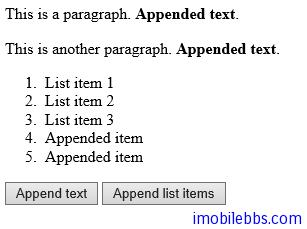
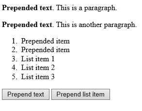
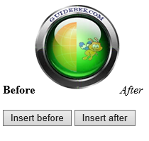

#添加HTML元素

使用 jQuery 可以方便的添加新的 HTML 元素。

下面的方法用于添加 HTML 元素：

- append() – 在指定的元素的尾部添加一个新内容。
- prepend() -在指定的元素里前部添加新内容。
- after() – 在指定元素前添加新内容
- before() -在指定元素的后面添加新内容。


乍一看 append,prepend 和 after,before 似乎功能一样，但 append,prepend 指在选中的元素本身（内部）的前面和后面，而 after,before 指在选择中的元素的前面和后面。

可以参考下面的 append 例子：

```
<!DOCTYPE html>
<html>
<head>
    <meta charset="utf-8">
    <title>JQuery Demo</title>
    <script src="scripts/jquery-1.9.1.js"></script>
    <script>
        $(document).ready(function () {
            $("#btn1").click(function () {
                $("p").append(" <b>Appended text</b>.");
            });

            $("#btn2").click(function () {
                $("ol").append("<li>Appended item</li>");
            });
        });
    </script>
</head>

<body>
    <p>This is a paragraph.</p>
    <p>This is another paragraph.</p>
    <ol>
        <li>List item 1</li>
        <li>List item 2</li>
        <li>List item 3</li>
    </ol>
    <button id="btn1">Append text</button>
    <button id="btn2">Append list items</button>
</body>
</html>
```



prepend 示例：

```
<!DOCTYPE html>
<html>
<head>
    <meta charset="utf-8">
    <title>JQuery Demo</title>
    <script src="scripts/jquery-1.9.1.js"></script>
    <script>
        $(document).ready(function () {
            $("#btn1").click(function () {
                $("p").prepend("<b>Prepended text</b>. ");
            });
            $("#btn2").click(function () {
                $("ol").prepend("<li>Prepended item</li>");
            });
        });
    </script>
</head>
<body>

    <p>This is a paragraph.</p>
    <p>This is another paragraph.</p>
    <ol>
        <li>List item 1</li>
        <li>List item 2</li>
        <li>List item 3</li>
    </ol>

    <button id="btn1">Prepend text</button>
    <button id="btn2">Prepend list item</button>

</body>
</html>
```



append(),prepend()支持同时插入多个元素，下面的例子添加三个使用不同方法创建的新元素：

```
function appendText()
 {
 // Create element with HTML
 var txt1="<p>Text.</p>";
// Create with jQuery
 var txt2=$("<p></p>").text("Text.");
 // Create with DOM
 var txt3=document.createElement("p");
 txt3.innerHTML="Text.";
 // Append the new elements
 $("p").append(txt1,txt2,txt3);
 }
```

下面的例子使用 after,before 在指定的元素前后面添加新内容：

```
<!DOCTYPE html>
<html>
<head>
    <meta charset="utf-8">
    <title>JQuery Demo</title>
    <script src="scripts/jquery-1.9.1.js"></script>
    <script>
        $(document).ready(function () {
            $("#btn1").click(function () {
                $("img").before("<b>Before</b>");
            });

            $("#btn2").click(function () {
                $("img").after("<i>After</i>");
            });
        });
    </script>
</head>

<body>
    
    <br>
    <br>
    <button id="btn1">Insert before</button>
    <button id="btn2">Insert after</button>
</body>
</html>
```



同样 after,before 也支持同时插入多个元素：

```
function afterText()
 {
  // Create element with HTML 
 var txt1="<b>I </b>";   
// Create with jQuery 
 var txt2=$("<i></i>").text("love ");   
// Create with DOM 
 var txt3=document.createElement("big");  
 txt3.innerHTML="jQuery!";
  // Insert new elements after img
 $("img").after(txt1,txt2,txt3);         
 }
```
