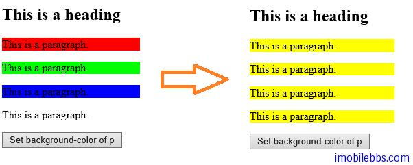

#读写 HTML 元素的 css 属性

jQuery 的 css()方法用来设置或读取 HTML 元素的 css 属性。

读取元素的 CSS 语法语法如下：

css(“propertyname“);

比如下面代码取得第一个<p>元素的背景颜色。

```
$("p").css("background-color");
```

使用下面的语法来设置 HTML 元素的 CSS 属性：

css(“propertyname“,”value“);

例如，下面代码为所有<p>元素设置背景色为黄色。

```
<!DOCTYPE html>
<html>
<head>
    <meta charset="utf-8">
    <title>JQuery Demo</title>
    <script src="scripts/jquery-1.9.1.js"></script>
    <script>
        $(document).ready(function () {
            $("button").click(function () {
                $("p").css("background-color", "yellow");
            });
        });
    </script>
</head>

<body>
    <h2>This is a heading</h2>
    <p style="background-color: #ff0000">This is a paragraph.</p>
    <p style="background-color: #00ff00">This is a paragraph.</p>
    <p style="background-color: #0000ff">This is a paragraph.</p>
    <p>This is a paragraph.</p>
    <button>Set background-color of p</button>
</body>
</html>
```



css()也支持同时多个 CSS 属性：其语法如下：

css({“propertyname“:”value“,”propertyname“:”value“,…});

比如：

```
$("p").css({"background-color":"yellow","font-size":"200%"})
```


