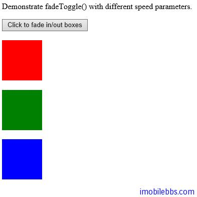

#淡入淡出效果

jQuery 提供了下面几种方法可以实现显示的淡入淡出效果：

- fadeIn()
- fadeOut()
- fadeToggle()
- fadeTo()

fadeIn()方法

fadeIn()实现淡入效果，其基本语法如下：

```
$(selector).fadeIn(speed,callback);
```

可选参数 speed 给出了淡入效果的时间，可以使用 “slow”,”fast” 或是数值（微秒）
第二个可选参数为回调函数，在 fadeIn()方法结束后调用。

```
$("button").click(function(){
  $("#div1").fadeIn();
  $("#div2").fadeIn("slow");
  $("#div3").fadeIn(3000);
});
```

fadeOut()方法

fadeOut()实现淡出效果，其基本语法如下：

```
$(selector).fadeOut(speed,callback);
```

可选参数 speed 给出了淡入效果的时间，可以使用 “slow”,”fast” 或是数值（微秒）
第二个可选参数为回调函数，在 fadeIn()方法结束后调用。

```
$("button").click(function(){
  $("#div1").fadeOut();
  $("#div2").fadeOut("slow");
  $("#div3").fadeOut(3000);
});
```

fadeToggle()方法

fadeToggle()交替进行 fadeIn()和 fadeOut()，如果元素是淡出的，那么 fadeToggle()将淡入该元素，如果之前是淡入的，fadeToggle 将淡出该元素。

其基本语法如下：

```
$(selector).fadeToggle(speed,callback);
```

可选参数 speed 给出了淡入效果的时间，可以使用 “slow”,”fast” 或是数值（微秒）
第二个可选参数为回调函数，在 fadeIn()方法结束后调用。

下面例子，点击按钮之后，可以交替淡出淡入三个矩形。

```
<!DOCTYPE html>
<html>
<head>
    <meta charset="utf-8">
    <title>JQuery Demo</title>
    <script src="scripts/jquery-1.9.1.js"></script>
    <script>
        $(document).ready(function () {
            $("button").click(function () {
                $("#div1").fadeToggle();
                $("#div2").fadeToggle("slow");
                $("#div3").fadeToggle(3000);
            });
        });
    </script>
</head>
<body>

    <p>Demonstrate fadeToggle() with different speed parameters.</p>
    <button>Click to fade in/out boxes</button>
    <br>
    <br>

    <div id="div1" style="width: 80px; height: 80px;
        background-color: red;"></div>
    <br>
    <div id="div2" style="width: 80px; height: 80px;
        background-color: green;"></div>
    <br>
    <div id="div3" style="width: 80px; height: 80px;
     background-color: blue;"></div>

</body>
</html>
```



fadeTo()方法

fadeTo()实现淡化到指定的透明度，其基本语法如下

```
$(selector).fadeTo(speed,opacity,callback);
```

必需参数 speed 给出了淡入效果的时间，可以使用 “slow”,”fast” 或是数值（微秒）
第二个必须参数为透明度，值域为0到1之间。

可选参数为回调函数，在 fadeIn()方法结束后调用。

```
$("button").click(function(){
  $("#div1").fadeTo("slow",0.15);
  $("#div2").fadeTo("slow",0.4);
  $("#div3").fadeTo("slow",0.7);
});
```

 


