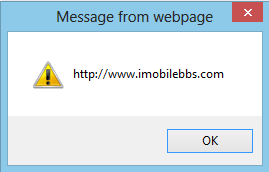

#HTML Get

jQuery 库包含了很多用来改变和操作 HTML 元素及其属性的方法。

其中一个非常重要的部分就是 jQuery 可以用来操作 DOM。

本篇介绍使用 jQuery 来取得 DOM 节点元素的值或属性。

其中三个简单而有用的方法如下：

- text() – 设置或取得指定元素的文本内容。
- html() – 设置或取得指定元素的内容（包括 HTML 标记）
- val() – 设置或取得表单某个输入域的值。

例如，下面代码使用 html()和 text()方法取得 HTML 元素的内容：

```
$("#btn1").click(function(){
  alert("Text: " + $("#test").text());
});
$("#btn2").click(function(){
  alert("HTML: " + $("#test").html());
});
```

下面的代码取得 Form 中 Input 的内容：

```
$("#btn1").click(function(){
  alert("Value: " + $("#test").val());
});
```

除了上面的方法外，attr()方法用来取得某个元素的属性：

下面代码用来取得链接的 href 属性：

```
<!DOCTYPE html>
<html>
<head>
<meta charset="utf-8">
<title>JQuery Demo</title>
<script src="scripts/jquery-1.9.1.js"></script>
</script>
<script>
    $(document).ready(function () {
        $("button").click(function () {
            alert($("#guidebee").attr("href"));
        });
    });
</script>
</head>

<body>
<p><a
    href="http://www.imobilebbs.com"
    id="guidebee">
    imobilebbs.com
   </a></p>
<button>Show href Value</button>
</body>
</html>
```

