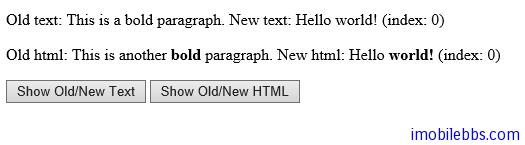

#HTML Set

上篇介绍 HTML Get，jQuery 其实使用上面同样的三个方法来赋值。

- text() – 设置或取得指定元素的文本内容。
- html() – 设置或取得指定元素的内容（包括 HTML 标记）
- val() – 设置或取得表单某个输入域的值。

比如下面代码就是使用上面三种方法给 HTML 元素或 Form 赋值

```
$("#btn1").click(function(){
   $("#test1").text("Hello world!");
 });
 $("#btn2").click(function(){
   $("#test2").html("<b>Hello world!</b>");
 });
 $("#btn3").click(function(){
   $("#test3").val("Dolly Duck");
 });
```

用于 text(),html()和 val()的回调函数

text(),html()和 val()方法可以和一个回调函数配合使用，这个回调函数具有两个参数，一个是选择中元素的序号，第二个为当前值（旧值），然后你可以通过回调函数的返回值做为元素的新值。

例如：

```
<!DOCTYPE html>
<html>
<head>
    <meta charset="utf-8">
    <title>JQuery Demo</title>
    <script src="scripts/jquery-1.9.1.js"></script>
    <script>
        $(document).ready(function () {
            $("#btn1").click(function () {
                $("#test1").text(function (i, origText) {
                    return "Old text: " + origText
                        + " New text: Hello world! (index: " + i + ")";
                });
            });

            $("#btn2").click(function () {
                $("#test2").html(function (i, origText) {
                    return "Old html: " + origText
                        + " New html: Hello <b>world!</b> (index: " + i + ")";
                });
            });

        });
    </script>
</head>

<body>
    <p id="test1">This is a <b>bold</b> paragraph.</p>
    <p id="test2">This is another <b>bold</b> paragraph.</p>
    <button id="btn1">Show Old/New Text</button>
    <button id="btn2">Show Old/New HTML</button>
</body>
</html>
```



同样为元素的属性赋值也使用 attr()方法，例如：

```
$("button").click(function(){
   $("#guidebee").attr({
     "href" : "http://www.imobilebbs.com",
     "title" : "imobilebbs jQuery Tutorial"
   });
 }); 
```
