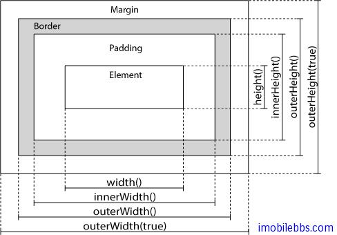

#操作 HTML 元素的大小

jQuery 提供下面方法来控制 HTML 元素的大小：

- width()
- height()
- innerWidth()
- innerHeight()
- outerWidth()
- outerHeight()


一般影响 HTML 元素 大小各部分的示意图如下所示：



jQuery width()和 height()方法

width()用来设置或取得元素的宽度，height()设置和取得元素的高度。

下面代码取得<div>元素的高度和宽度。

```
$("button").click(function(){
   var txt="";
   txt+="Width: " + $("#div1").width() + "</br>";
   txt+="Height: " + $("#div1").height();
   $("#div1").html(txt);
 });
```

jQuery 的 innerWidth()和 innerHeight()方法

innerWidth() 返回元素包括 Padding 的宽度，innerHeight()返回包括 Padding的高度。

jquery 的 outerWidth()和 outerHeight()方法

outerWidth()返回包括 padding 和 border 的宽度，outerHeight()返回包括 padding 和　border 的高度。
 
而 outWidth(true)和 outHeight(true) 返回包括 padding, border 和 margin 的高度和宽度。

下面的例子设置指定

元素的宽度和高度：

```
$("button").click(function(){
   $("#div1").width(500).height(500);
 });
```


