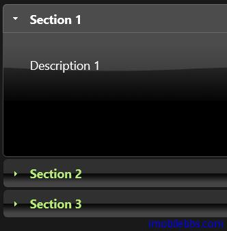
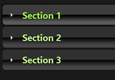
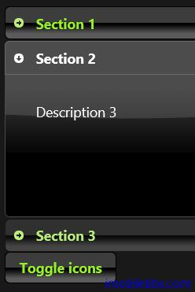
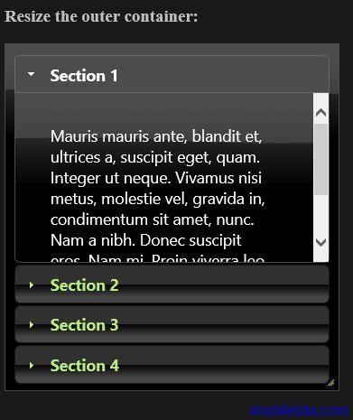
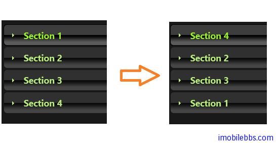

#jQuery UI Accordion 示例

本篇介紹 Accordion 組件（類似手風琴可以摺疊的 UI 組件）。

##基本用法

jQuery Accordion UI 組件可以把一個包含有具有 Header (標題頭）和 Content（內容）對的容器轉變成 Accordion 組件。

比如如下一個 Id=”accordion”Div HTML 元素。

```
<div id="accordion">
	<h1>Section 1</h1>
	<div>
		<p>Description 1</p>
	</div>
	<h2>Section 2</h2>
	<div>
		<p>Description 3</p>
	</div>
	<h3>Section 3</h3>
	<div>
		<p>Description 3</p>
		<ul>
			<li>List item one</li>
			<li>List item two</li>
			<li>List item three</li>
		</ul>
	</div>
</div>
```

對於 ＜div id=”accordion”> 裡面的元素，According 允許使用任意的標記，只要是一個 Header 緊接著一個 Content，比如上面的 H3，你可以換成 H1，H2等其它標記，或者通過 Header 選項來配置。
有了這樣的 HTML 元素，然後對其使用 Accordion 方法，就將該 HTML 元素變成 Accordion 樣式了

```
<script>
	$("#accordion").accordion();
</script>
```

本例完整代碼如下：

```
<!doctype html>
<html lang="en">
<head>
    <meta charset="utf-8" />
    <title>jQuery UI Demos</title>
    <link rel="stylesheet" href="themes/trontastic/jquery-ui.css" />
    <script src="scripts/jquery-1.9.1.js"></script>
    <script src="scripts/jquery-ui-1.10.1.custom.js"></script>

    <script>
        $(function () {

        });
    </script>
</head>
<body>
    <div id="accordion">
        <h1>Section 1</h1>
        <div>
            <p>Description 1</p>
        </div>
        <h2>Section 2</h2>
        <div>
            <p>Description 3</p>
        </div>
        <h3>Section 3</h3>
        <div>
            <p>Description 3</p>
            <ul>
                <li>List item one</li>
                <li>List item two</li>
                <li>List item three</li>
            </ul>
        </div>
    </div>

    <script>
        $("#accordion").accordion();
    </script>
</body>
</html>
```



##摺疊內容

Accordion 組件預設情況下總有一項內容是展開的，如說圖 Section1的內容是可見的，點擊其它部分的標題，該部分內容可見，但無法將所有內容都摺疊起來，如果要支持所有部分都可以摺疊，可以通過配置 collapsible 屬性，如：

```
$(function() {
    $( "#accordion" ).accordion({
      collapsible: true
    });
  });
```



##自定義圖標

可以自定義 Accordion 組件標題前的圖標，預設的圖標為箭頭（未展開是箭頭向右，展開時向下），使用 jQuery CSS 框架中定義的類或是通過自定義背景圖像類，可以重新配置這兩個圖標：

```
$(function() {
    var icons = {
      header: "ui-icon-circle-arrow-e",
      activeHeader: "ui-icon-circle-arrow-s"
    };
    $( "#accordion" ).accordion({
      icons: icons
    });
    $( "#toggle" ).button().click(function() {
      if ( $( "#accordion" ).accordion( "option", "icons" ) ) {
        $( "#accordion" ).accordion( "option", "icons", null );
      } else {
        $( "#accordion" ).accordion( "option", "icons", icons );
      }
    });
  });
```



##設置 HeightStyle

因為 Accordion 由「Block 級」元素組成（可以參加 CSS 的 display)，因此它預設在水平方向佔據父元素的寬度，為了在高度方向也能充滿其父容器，可以通過配置 heightStyle 為 fill .HeightStyle 可以使用的值如下：

- "auto": 所有 Panel 使用最高的那個 Panel 的高度.
- "fill": 根據父容器的高度來填充.
- "content": 每個 Penel 的高度取決於其內容.

```
<!doctype html>
<html lang="en">
<head>
    <meta charset="utf-8" />
    <title>jQuery UI Demos</title>
    <link rel="stylesheet" href="themes/trontastic/jquery-ui.css" />
    <script src="scripts/jquery-1.9.1.js"></script>
    <script src="scripts/jquery-ui-1.10.1.custom.js"></script>

    <style>
        #accordion-resizer {
            padding: 10px;
            width: 350px;
            height: 300px;
        }
    </style>
    <script>
        $(function () {
            $("#accordion").accordion({
                heightStyle: "fill"
            });
        });
        $(function () {
            $("#accordion-resizer").resizable({
                minHeight: 140,
                minWidth: 200,
                resize: function () {
                    $("#accordion").accordion("refresh");
                }
            });
        });
    </script>
</head>
<body>
    <h3 class="docs">Resize the outer container:</h3>

    <div id="accordion-resizer" class="ui-widget-content">
        <div id="accordion">
            <h3>Section 1</h3>
            <div>
                <p>Mauris mauris ante, blandit et,
                    ultrices a, suscipit eget,
                    quam. Integer ut neque. Vivamus nisi metus,
                     molestie vel, gravida in,
                    condimentum sit amet, nunc. Nam a nibh.
                     Donec suscipit eros. Nam mi.
                    Proin viverra leo ut odio.
                    Curabitur malesuada.
                    Vestibulum a velit eu ante
                    scelerisque vulputate.</p>
            </div>
            <h3>Section 2</h3>
            <div>
                <p>Sed non urna. Donec et ante.
                    Phasellus eu ligula.
                    Vestibulum sit amet purus.
                    Vivamus hendrerit,
                    dolor at aliquet laoreet,
                     mauris turpis porttitor velit,
                    faucibus interdum tellus
                    libero ac justo.
                    Vivamus non quam.
                    In suscipit faucibus urna. </p>
            </div>
            <h3>Section 3</h3>
            <div>
                <p>Nam enim risus, molestie et,
                     porta ac,
                    aliquam ac, risus. Quisque lobortis.
                    Phasellus pellentesque purus in massa.
                    Aenean in pede. Phasellus
                    ac libero ac tellus
                    pellentesque semper.
                    Sed ac felis. Sed commodo,
                    magna quis lacinia ornare,
                    quam ante aliquam nisi,
                    eu iaculis leo purus
                    venenatis dui. </p>
                <ul>
                    <li>List item one</li>
                    <li>List item two</li>
                    <li>List item three</li>
                </ul>
            </div>
            <h3>Section 4</h3>
            <div>
                <p>Cras dictum. Pellentesque
                    habitant morbi
                    tristique senectus et netus
                    et malesuada
                    fames ac turpis egestas.
                     Vestibulum
                    ante ipsum primis in faucibus
                    orci luctus
                    et ultrices posuere cubilia
                     Curae;
                    Aenean lacinia mauris
                     vel est. </p>
                <p>Suspendisse eu nisl. Nullam ut libero.
                    Integer dignissim consequat lectus.
                    Class aptent taciti sociosqu ad litora
                    torquent per conubia nostra,
                    per inceptos himenaeos. </p>
            </div>
        </div>
    </div>

</body>
</html>
```



##滑鼠移動式自動打開內容

預設情況下，打開 Accordion 某個部分內容，是點擊該部分標題，如果需要實現移動滑鼠到該部分自動展開內容，可以設置 event 屬性，例如：

```
 $(function () {
	$("#accordion").accordion({
		event: "mouseover"
	});
});
```

##支持調整順序

使用 sortable 方法允許重新調整 Accordion 每個部分的順序，可以通過拖放的方法調整順序：

查看源代碼列印幫助

```
<!doctype html>
<html lang="en">
<head>
    <meta charset="utf-8" />
    <title>jQuery UI Demos</title>
    <link rel="stylesheet" href="themes/trontastic/jquery-ui.css" />
    <script src="scripts/jquery-1.9.1.js"></script>
    <script src="scripts/jquery-ui-1.10.1.custom.js"></script>
    <style>
        /* IE has layout issues when sorting (see #5413) */
        .group {
            zoom: 1;
        }
    </style>
    <script>
        $(function () {
            $("#accordion").accordion({
                header: "> div > h3",
                collapsible: true
            }).sortable({
                axis: "y",
                handle: "h3",
                stop: function (event, ui) {
                    // IE doesn't register the blur when sorting
                    // so trigger focusout handlers to remove .ui-state-focus
                    ui.item.children("h3").triggerHandler("focusout");
                }
            });;
        });
    </script>
</head>
<body>
    <div id="accordion">
        <div class="group">
            <h3>Section 1</h3>

            <div>
                <p>Description 1</p>
            </div>
        </div>
        <div class="group">
            <h3>Section 2</h3>
            <div>
                <p>Description 2</p>
            </div>
        </div>
        <div class="group">
            <h3>Section 3</h3>

            <div>
                <p>Description 3</p>
                <ul>
                    <li>List item one</li>
                    <li>List item two</li>
                    <li>List item three</li>
                </ul>
            </div>
        </div>
        <div class="group">
            <h3>Section 4</h3>

            <div>
                <p>Description 4</p>
            </div>
        </div>
    </div>

</body>
</html>
```



注意，這裡使用 Header 屬性，標題部分由 div ,h3 共同構成。

