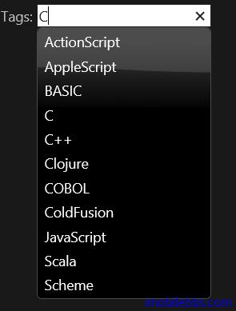
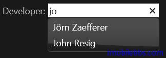
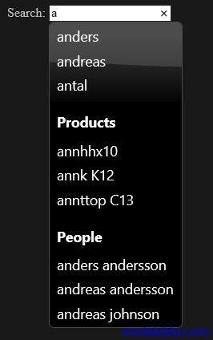

#jQuery UI Autocomplete 示例（一）

AutoComplete 在获取焦点后，随着用户键入的内容，可以在预订的数据源中查找和已输入的内容相匹配的内容列表供用户选择。

这可以用作之前输入过的内容也可以用作自动填充相关内容，比如根据城市名，自动填充邮编等。
你可以使用本地数据源或是远程数据源，本地数据一般使用小数据集合，比如包含50条记录的通讯录，远程数据源一般为保护大量记录的数据库。

##基本用法

本例为使用 AutoComplete 的基本用法，通过本地数据源（数组）定义一组语言列表，用户输入字母后，包含该字母的语言会作为列表显示出来：

```
<!doctype html>
<html lang="en">
<head>
    <meta charset="utf-8" />
    <title>jQuery UI Demos</title>
    <link rel="stylesheet" href="themes/trontastic/jquery-ui.css" />
    <script src="scripts/jquery-1.9.1.js"></script>
    <script src="scripts/jquery-ui-1.10.1.custom.js"></script>

    <script>
        $(function () {
            var availableTags = [
              "ActionScript",
              "AppleScript",
              "Asp",
              "BASIC",
              "C",
              "C++",
              "Clojure",
              "COBOL",
              "ColdFusion",
              "Erlang",
              "Fortran",
              "Groovy",
              "Haskell",
              "Java",
              "JavaScript",
              "Lisp",
              "Perl",
              "PHP",
              "Python",
              "Ruby",
              "Scala",
              "Scheme"
            ];
            $("#tags").autocomplete({
                source: availableTags
            });
        });
    </script>
</head>
<body>
    <div class="ui-widget">
        <label for="tags">Tags: </label>
        <input id="tags" />
    </div>
</body>
</html>
```



##语调支持

某些语言支持语调字符，比如 Jörn 中的 ö，希望在输入 o 时，也能显示包含 ö 的内容，AutoComplete 支持使用 function 来定义 Source 属性：

```
<!doctype html>
<html lang="en">
<head>
    <meta charset="utf-8" />
    <title>jQuery UI Demos</title>
    <link rel="stylesheet" href="themes/trontastic/jquery-ui.css" />
    <script src="scripts/jquery-1.9.1.js"></script>
    <script src="scripts/jquery-ui-1.10.1.custom.js"></script>

    <script>
        $(function () {
            var names = ["Jörn Zaefferer",
                "Scott González",
                "John Resig"];

            var accentMap = {
                "á": "a",
                "ö": "o"
            };
            var normalize = function (term) {
                var ret = "";
                for (var i = 0; i < term.length; i++) {
                    ret += accentMap[term.charAt(i)]
                        || term.charAt(i);
                }
                return ret;
            };

            $("#developer").autocomplete({
                source: function (request, response) {
                    var matcher
                        = new RegExp($.ui.autocomplete
                            .escapeRegex(request.term),"i");
                    response($.grep(names, function (value) {
                        value = value.label
                            || value.value
                            || value;
                        return matcher.test(value)
                            || matcher.test(normalize(value));
                    }));
                }
            });
        });
    </script>
</head>
<body>
    <div class="ui-widget">
        <form>
            <label for="developer">Developer: </label>
            <input id="developer" />
        </form>
    </div>
</body>
</html>
```



##分类支持

本例是提供简单扩展 AutoComplete 组件实现了一个自定义的 custom.catcomplete UI 组件以支持AutoComplete 的分类支持。自定义组件有兴趣的可以参见 jQuery 的 Widget Factory。一般无需自定义 UI 组件，如果需要，可以在网站查找是否有人已经实现你需要的 UI 组件，实在不行才自定义 UI组件，使用 Widget Factory 自定义组件的方法并不十分直观（这是因为 JavaScript 使用了面向“原型”的面向对象方法，而非通常的使用类的面向对象方法）。

```
<!doctype html>
<html lang="en">
<head>
    <meta charset="utf-8" />
    <title>jQuery UI Demos</title>
    <link rel="stylesheet" href="themes/trontastic/jquery-ui.css" />
    <script src="scripts/jquery-1.9.1.js"></script>
    <script src="scripts/jquery-ui-1.10.1.custom.js"></script>

    <style>
        .ui-autocomplete-category {
            font-weight: bold;
            padding: .2em .4em;
            margin: .8em 0 .2em;
            line-height: 1.5;
        }
    </style>
    <script>
        $.widget("custom.catcomplete", $.ui.autocomplete, {
            _renderMenu: function (ul, items) {
                var that = this,
                  currentCategory = "";
                $.each(items, function (index, item) {
                    if (item.category != currentCategory) {
                        ul.append("<li class='ui-autocomplete-category'>"
                            + item.category + "</li>");
                        currentCategory = item.category;
                    }
                    that._renderItemData(ul, item);
                });
            }
        });
    </script>
    <script>
        $(function () {
            var data = [
              { label: "anders", category: "" },
              { label: "andreas", category: "" },
              { label: "antal", category: "" },
              { label: "annhhx10", category: "Products" },
              { label: "annk K12", category: "Products" },
              { label: "annttop C13", category: "Products" },
              { label: "anders andersson", category: "People" },
              { label: "andreas andersson", category: "People" },
              { label: "andreas johnson", category: "People" }
            ];

            $("#search").catcomplete({
                delay: 0,
                source: data
            });
        });
    </script>
</head>
<body>
    <label for="search">Search: </label>
    <input id="search" />
</body>
</html>
```

其中 custom.catcomplete 为自定义的 UI 组件，因此 $( “#search” ).catcomplete 使用 catcomplete ，而非 autocomplete。

