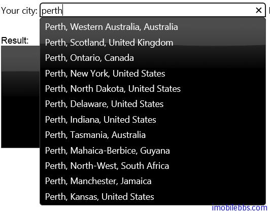

#jQuery UI Autocomplete 示例（三）

AutoComplete 在用戶輸入時，可以根據用戶輸入給出提示。其數據源可以來自本地，也可以使用遠程數據源，AutoComplete 的 DataSource 可以使用一個 Function，本篇中的 Function，我們使用 JSONP 查詢。　

當數據源為 Function 時，其函數定義為：

Function( Object request, Function response( Object data））

其中 request 為請求，它含有一個 term 屬性，為當前用戶輸入。

response 為一回調函數，它有一個參數 data,用來提示用戶的數據，這個值理應根據輸入的 term 進行過濾。

本例使用由 [genames](http://geonames.org/) 提供的 Web Service。可以查詢世界的城市名稱。使用了 jQuery 提供的.ajax 函數來訪問這個 Web Service.

```
$( "#city" ).autocomplete({
  source: function( request, response ) {
	$.ajax({
	  url: "http://ws.geonames.org/searchJSON",
	  dataType: "jsonp",
	  data: {
		featureClass: "P",
		style: "full",
		maxRows: 12,
		name_startsWith: request.term
	  },
	  success: function( data ) {
		response( $.map( data.geonames, function( item ) {
		  return {
			label: item.name + (item.adminName1 ? ", " 
			+ item.adminName1 : "") + ", " + item.countryName,
			value: item.name
		  };
		}));
	  }
	});
  },
```



