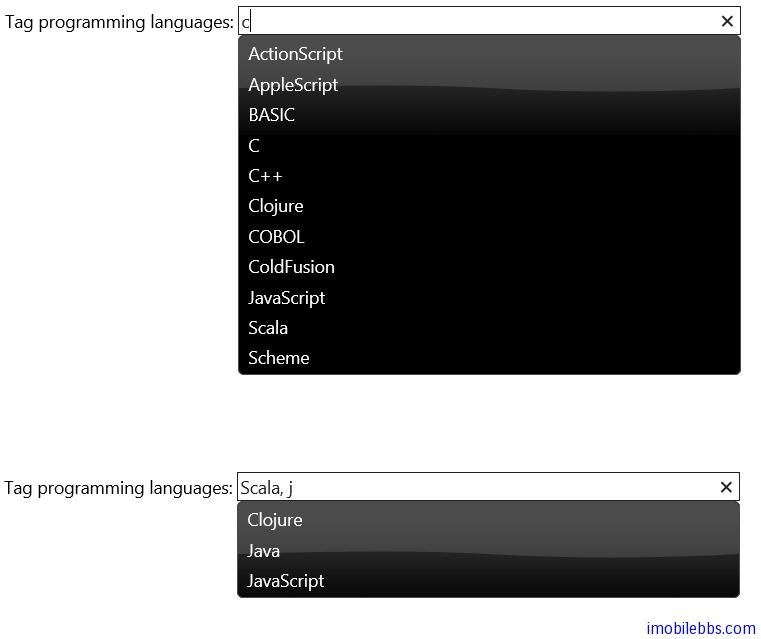

#jQuery UI Autocomplete 示例（二）

如果一個輸入框可以接受多個輸入項，比如選擇你喜歡的語言，以逗號隔開，這是也可以使用 AutoComplete 為每個輸入項提供輸入提示。不過此時除了設置數據源外，還需要添加一些事件處理。

```
<!doctype html>
<html lang="en">
<head>
    <meta charset="utf-8" />
    <title>jQuery UI Demos</title>
    <link rel="stylesheet" href="themes/trontastic/jquery-ui.css" />
    <script src="scripts/jquery-1.9.1.js"></script>
    <script src="scripts/jquery-ui-1.10.1.custom.js"></script>

    <script>
        $(function () {
            var availableTags = [
              "ActionScript",
              "AppleScript",
              "Asp",
              "BASIC",
              "C",
              "C++",
              "Clojure",
              "COBOL",
              "ColdFusion",
              "Erlang",
              "Fortran",
              "Groovy",
              "Haskell",
              "Java",
              "JavaScript",
              "Lisp",
              "Perl",
              "PHP",
              "Python",
              "Ruby",
              "Scala",
              "Scheme"
            ];
            function split(val) {
                return val.split(/,\s*/);
            }
            function extractLast(term) {
                return split(term).pop();
            }

            $("#tags")
            // don't navigate away from the field on tab 
            //when selecting an item
              .bind("keydown", function (event) {
                  if (event.keyCode === $.ui.keyCode.TAB &&
                      $(this).data("ui-autocomplete").menu.active) {
                      event.preventDefault();
                  }
              })
              .autocomplete({
                  minLength: 0,
                  source: function (request, response) {
                      // delegate back to autocomplete, 
                      // but extract the last term
                      response($.ui.autocomplete.filter(
                        availableTags, extractLast(request.term)));
                  },
                  focus: function () {
                      // prevent value inserted on focus
                      return false;
                  },
                  select: function (event, ui) {
                      var terms = split(this.value);
                      // remove the current input
                      terms.pop();
                      // add the selected item
                      terms.push(ui.item.value);
                      // add placeholder to get the 
                      //comma-and-space at the end
                      terms.push("");
                      this.value = terms.join(", ");
                      return false;
                  }
              });
        });
    </script>
</head>
<body>
    <div class="ui-widget">
        <label for="tags">Tag programming languages: </label>
        <input id="tags" size="50" />
    </div>
</body>
</html>
```




