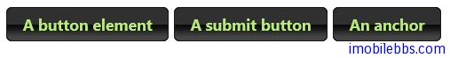
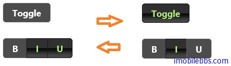
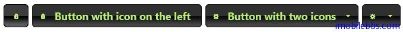

#jQuery UI Button 示例（一）

jQuery Button 组件可以增强表单（Form) 中的 Buttons，Inputs 和 Anchor元素，使其具有按钮显示风格，能够正确对鼠标滑动做出反应。

##基本用法

下例显示把表单中的 button,input 和 anchor 元素都变为按钮风格的 jQuery Button 组件。

```
<!doctype html>
<html lang="en">
<head>
    <meta charset="utf-8" />
    <title>jQuery UI Demos</title>
    <link rel="stylesheet" href="themes/trontastic/jquery-ui.css" />
    <script src="scripts/jquery-1.9.1.js"></script>
    <script src="scripts/jquery-ui-1.10.1.custom.js"></script>
    <script>
        $(function () {
            $("input[type=submit], a, button")
              .button()
              .click(function (event) {
                  event.preventDefault();
              });
        });
    </script>
</head>
<body>

    <button>A button element</button>

    <input type="submit" value="A submit button" />

    <a href="#">An anchor</a>

</body>
</html>
```



##checkboxes

除了支持基本的按钮外，jQuery Button 组件可以把类型为 checkbox 的 input 元素变为按钮，这种按钮可以有两种状态，原态和按下状态。

```
<!doctype html>
<html lang="en">
<head>
    <meta charset="utf-8" />
    <title>jQuery UI Demos</title>
    <link rel="stylesheet" href="themes/trontastic/jquery-ui.css" />
    <script src="scripts/jquery-1.9.1.js"></script>
    <script src="scripts/jquery-ui-1.10.1.custom.js"></script>
    <script>
        $(function () {
            $("input[type=submit], a, button")
              .button()
              .click(function (event) {
                  event.preventDefault();
              });
        });
    </script>
</head>
<body>
    <button>A button element</button>
    <input type="submit" value="A submit button" />
    <a href="#">An anchor</a>
</body>
</html>
```



##显示图标

按钮也可以添加图标，可以支持多个图标，分别使用 primary 和 secondary 来指明。

```
<!doctype html>
<html lang="en">
<head>
    <meta charset="utf-8" />
    <title>jQuery UI Demos</title>
    <link rel="stylesheet" href="themes/trontastic/jquery-ui.css" />
    <script src="scripts/jquery-1.9.1.js"></script>
    <script src="scripts/jquery-ui-1.10.1.custom.js"></script>
    <script>
        $(function () {
            $("button:first").button({
                icons: {
                    primary: "ui-icon-locked"
                },
                text: false
            }).next().button({
                icons: {
                    primary: "ui-icon-locked"
                }
            }).next().button({
                icons: {
                    primary: "ui-icon-gear",
                    secondary: "ui-icon-triangle-1-s"
                }
            }).next().button({
                icons: {
                    primary: "ui-icon-gear",
                    secondary: "ui-icon-triangle-1-s"
                },
                text: false
            });
        });
    </script>
</head>
<body>
    <button>Button with icon only</button>
    <button>Button with icon on the left</button>
    <button>Button with two icons</button>
    <button>Button with two icons and no text</button>
</body>
</html>
```



##Radio 单选钮

同样，jQuery 也把 type 为 radio 的一组 Radio 按钮构成一组单选钮，使用.buttonset 将多个单选钮定义为一个组，其中只有一个可以是选中状态。

```
<!doctype html>
<html lang="en">
<head>
    <meta charset="utf-8" />
    <title>jQuery UI Demos</title>
    <link rel="stylesheet" href="themes/trontastic/jquery-ui.css" />
    <script src="scripts/jquery-1.9.1.js"></script>
    <script src="scripts/jquery-ui-1.10.1.custom.js"></script>
    <script>
        $(function () {
            $("#radio").buttonset();
        });
  </script>
</head>
<body>

<form>
  <div id="radio">
      <input type="radio" id="radio1" name="radio" />
      <label for="radio1">Choice 1</label>
      <input type="radio" id="radio2" name="radio" checked="checked" />
      <label for="radio2">Choice 2</label>
      <input type="radio" id="radio3" name="radio" />
      <label for="radio3">Choice 3</label>
  </div>
</form>
 </body>
</html>
```


