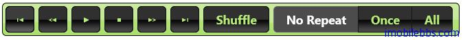

#jQuery UI Button 示例（二）

本例为使用 jQuery 的一个实用的例子，显示媒体播放器的控制条。其中按钮的图标使用 jQuery 库自带的 CSS 定义的一些图标（比如 ui-icon-seek-end 等）。

```
<!doctype html>
<html lang="en">
<head>
    <meta charset="utf-8" />
    <title>jQuery UI Demos</title>
    <link rel="stylesheet" href="themes/trontastic/jquery-ui.css" />
    <script src="scripts/jquery-1.9.1.js"></script>
    <script src="scripts/jquery-ui-1.10.1.custom.js"></script>
    <style>
        #toolbar {
            padding: 4px;
            display: inline-block;
        }
        /* support: IE7 */
        * + html #toolbar {
            display: inline;
        }
    </style>
    <script>
        $(function () {
            $("#beginning").button({
                text: false,
                icons: {
                    primary: "ui-icon-seek-start"
                }
            });
            $("#rewind").button({
                text: false,
                icons: {
                    primary: "ui-icon-seek-prev"
                }
            });
            $("#play").button({
                text: false,
                icons: {
                    primary: "ui-icon-play"
                }
            })
            .click(function () {
                var options;
                if ($(this).text() === "play") {
                    options = {
                        label: "pause",
                        icons: {
                            primary: "ui-icon-pause"
                        }
                    };
                } else {
                    options = {
                        label: "play",
                        icons: {
                            primary: "ui-icon-play"
                        }
                    };
                }
                $(this).button("option", options);
            });
            $("#stop").button({
                text: false,
                icons: {
                    primary: "ui-icon-stop"
                }
            })
            .click(function () {
                $("#play").button("option", {
                    label: "play",
                    icons: {
                        primary: "ui-icon-play"
                    }
                });
            });
            $("#forward").button({
                text: false,
                icons: {
                    primary: "ui-icon-seek-next"
                }
            });
            $("#end").button({
                text: false,
                icons: {
                    primary: "ui-icon-seek-end"
                }
            });
            $("#shuffle").button();
            $("#repeat").buttonset();
        });
    </script>
</head>
<body>

    <div id="toolbar" class="ui-widget-header ui-corner-all">
        <button id="beginning">go to beginning</button>
        <button id="rewind">rewind</button>
        <button id="play">play</button>
        <button id="stop">stop</button>
        <button id="forward">fast forward</button>
        <button id="end">go to end</button>

        <input type="checkbox" id="shuffle" />
        <label for="shuffle">Shuffle</label>

        <span id="repeat">
            <input type="radio" id="repeat0" name="repeat" 
                checked="checked" />
            <label for="repeat0">No Repeat</label>
            <input type="radio" id="repeat1" name="repeat" />
            <label for="repeat1">Once</label>
            <input type="radio" id="repeatall" name="repeat" />
            <label for="repeatall">All</label>
        </span>
    </div>
</body>
</html>
```



