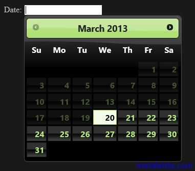
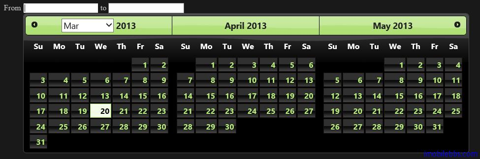

#jQuery UI Datepicker 示例（五）

##设置可以选择的日期范围

有时希望用户在给定的日期内选择，比如预约会议的时间，只能在当天开始的一个月带10天以内。这时可以通过配置 minDate 和 maxDate 来设置，如果 minDate 或 maxDate 没有配置，表示没有最小日期或最大日期的限制。

```
<!doctype html>
<html lang="en">
<head>
    <meta charset="utf-8" />
    <title>jQuery UI Demos</title>
    <link rel="stylesheet" href="themes/trontastic/jquery-ui.css" />
    <script src="scripts/jquery-1.9.1.js"></script>
    <script src="scripts/jquery-ui-1.10.1.custom.js"></script>
   <script>
       $(function () {
           $("#datepicker").datepicker({
               minDate: 0,
               maxDate: "+1M +10D"
           });
       });
  </script>
</head>
<body>
 
<p>Date: <input type="text" id="datepicker" /></p>
 
</body>
</html>
```



可以看到小于当天的日期变灰且无法选择。

##设置日期范围

可以使用两个 DatePicker 配合使用，用户可以选择一个开始日期和一个终止日期。

```
<!doctype html>
<html lang="en">
<head>
    <meta charset="utf-8" />
    <title>jQuery UI Demos</title>
    <link rel="stylesheet" href="themes/trontastic/jquery-ui.css" />
    <script src="scripts/jquery-1.9.1.js"></script>
    <script src="scripts/jquery-ui-1.10.1.custom.js"></script>
    <script>
        $(function () {
            $("#from").datepicker({
                defaultDate: "+1w",
                changeMonth: true,
                numberOfMonths: 3,
                onClose: function (selectedDate) {
                    $("#to").datepicker("option", "minDate", selectedDate);
                }
            });
            $("#to").datepicker({
                defaultDate: "+1w",
                changeMonth: true,
                numberOfMonths: 3,
                onClose: function (selectedDate) {
                    $("#from").datepicker("option", "maxDate", selectedDate);
                }
            });
        });
    </script>
</head>
<body>

    <label for="from">From</label>
    <input type="text" id="from" name="from" />
    <label for="to">to</label>
    <input type="text" id="to" name="to" />

</body>
</html>
```


