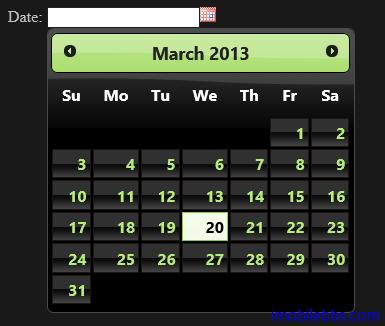

#jQuery UI Datepicker 示例（四）

DatePicker 支持使用另外的按钮控制日期选择界面显示，可以通过自定义的图标来显示这个按钮。

```
<!doctype html>
<html lang="en">
<head>
    <meta charset="utf-8" />
    <title>jQuery UI Demos</title>
    <link rel="stylesheet" href="themes/trontastic/jquery-ui.css" />
    <script src="scripts/jquery-1.9.1.js"></script>
    <script src="scripts/jquery-ui-1.10.1.custom.js"></script>
    <script>
        $(function () {
            $("#datepicker").datepicker({
                showOn: "button",
                buttonImage: "images/calendar.gif",
                buttonImageOnly: true
            });
        });
  </script>
</head>
<body>
 
<p>Date: <input type="text" id="datepicker" /></p>
 
 
</body>
</html>
```

buttonImage 设置按钮显示图标。


