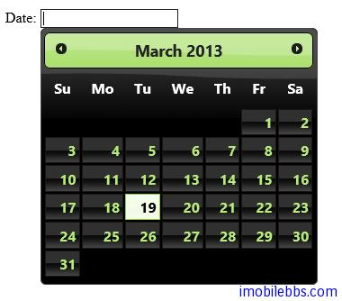

#jQuery UI Datepicker 示例（一）

jQuery UI 提供的 Datepicker 是一个有着非常灵活配置的选择日期的 UI 组件，你可以配置显示日期的格式，语言，限制所能选择的日期范围，添加按钮等。

##基本用法如下：

```
< !doctype html>
<html lang="en">
<head>
    <meta charset="utf-8" />
    <title>jQuery UI Demos</title>
    <link rel="stylesheet" href="themes/trontastic/jquery-ui.css" />
    <script src="scripts/jquery-1.9.1.js"></script>
    <script src="scripts/jquery-ui-1.10.1.custom.js"></script>
<script>
    $(function () {
        $("#datepicker").datepicker();
    });
  </script>
</head>
<body>
 
<p>Date: <input type="text" id="datepicker" /></p>
 </body>
</html>
```

只需要给选择的 HTML 元素调用其构造函数即可。



##使用动画效果

显示和隐藏 DatePicker 组件支持配置使用不同的动画效果，下列使用一个列表框来选择 DatePicker可以支持的动画效果。

```
<!doctype html>
<html lang="en">
<head>
    <meta charset="utf-8" />
    <title>jQuery UI Demos</title>
    <link rel="stylesheet" href="themes/trontastic/jquery-ui.css" />
    <script src="scripts/jquery-1.9.1.js"></script>
    <script src="scripts/jquery-ui-1.10.1.custom.js"></script>
    <script>
        $(function () {
            $("#datepicker").datepicker();
            $("#anim").change(function () {
                $("#datepicker").datepicker("option",
                    "showAnim", $(this).val());
            });
        });
    </script>
</head>
<body>

    <p>Date:
        <input type="text" id="datepicker" size="30" /></p>

    <p>
        Animations:<br />
        <select id="anim">
            <option value="show">Show (default)</option>
            <option value="slideDown">Slide down</option>
            <option value="fadeIn">Fade in</option>
            <option value="blind">Blind (UI Effect)</option>
            <option value="bounce">Bounce (UI Effect)</option>
            <option value="clip">Clip (UI Effect)</option>
            <option value="drop">Drop (UI Effect)</option>
            <option value="fold">Fold (UI Effect)</option>
            <option value="slide">Slide (UI Effect)</option>
            <option value="">None</option>
        </select>
    </p>


</body>
</html>
```


