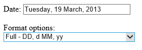
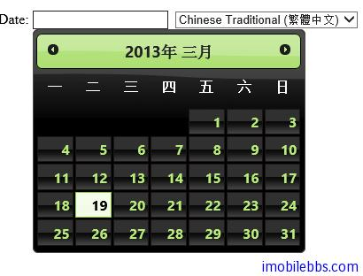

#jQuery UI Datepicker 示例（三）

#格式化日期

可以通過日期格式重新定義 Datepicker 顯示日期時的格式。

```
<!doctype html>
<html lang="en">
<head>
    <meta charset="utf-8" />
    <title>jQuery UI Demos</title>
    <link rel="stylesheet" href="themes/trontastic/jquery-ui.css" />
    <script src="scripts/jquery-1.9.1.js"></script>
    <script src="scripts/jquery-ui-1.10.1.custom.js"></script>
    <script>
        $(function () {
            $("#datepicker").datepicker();
            $("#format").change(function () {
                $("#datepicker").datepicker("option",
                    "dateFormat", $(this).val());
            });
        });
    </script>
</head>
<body>

    <p>Date:
        <input type="text" id="datepicker" size="30" /></p>
    <p>
        Format options:<br />
        <select id="format">
            <option value="mm/dd/yy">Default - mm/dd/yy</option>
            <option value="yy-mm-dd">ISO 8601 - yy-mm-dd</option>
            <option value="d M, y">Short - d M, y</option>
            <option value="d MM, y">Medium - d MM, y</option>
            <option value="DD, d MM, yy">Full - DD, d MM, yy</option>
            <option value="'day' d 'of' MM 'in the year' yy">
                With text - 'day' d 'of' MM 'in the year' yy
            </option>
        </select>
    </p>
</body>
</html>
```



##本地化支持

Datepicker 預設使用英語顯示，可以通過配置修改顯示語言。

如果需要支持不同語言，可以添加，如：

```
<!doctype html>
<html lang="en">
<head>
    <meta charset="utf-8" />
    <title>jQuery UI Demos</title>
    <link rel="stylesheet" href="themes/trontastic/jquery-ui.css" />
    <script src="scripts/jquery-1.9.1.js"></script>
    <script src="scripts/jquery-ui-1.10.1.custom.js"></script>
    <script src="scripts/jquery.ui.datepicker-ar.js"></script>
    <script src="scripts/jquery.ui.datepicker-fr.js"></script>
    <script src="scripts/jquery.ui.datepicker-he.js"></script>
    <script src="scripts/jquery.ui.datepicker-zh-TW.js"></script>

    <script>
        $(function () {
            $.datepicker.setDefaults($.datepicker.regional[""]);
            $("#datepicker").datepicker($.datepicker.regional["fr"]);
            $("#locale").change(function () {
                $("#datepicker").datepicker("option",
                  $.datepicker.regional[$(this).val()]);
            });
        });
    </script>
</head>
<body>
    <p>
        Date:
        <input type="text" id="datepicker" />&nbsp;
  <select id="locale">
      <option value="ar">Arabic (‫(لعربي</option>
      <option value="zh-TW">Chinese Traditional (繁體中文)</option>
      <option value="fr" selected="selected">French (Français)</option>
      <option value="he">Hebrew (‫(עברית</option>
  </select>
    </p>
</body>
</html>
```



如果需要添加自定義的語言，比如簡體中文，可以打開 jquery.ui.datepicker-zh-TW.js 看看，

```
/* Chinese initialisation for the jQuery UI date picker plugin. */
/* Written by Ressol (ressol@gmail.com). */
jQuery(function($){
	$.datepicker.regional['zh-TW'] = {
		closeText: '關閉',
		prevText: '&#x3C;上月',
		nextText: '下月&#x3E;',
		currentText: '今天',
		monthNames: ['一月','二月','三月','四月','五月','六月',
		'七月','八月','九月','十月','十一月','十二月'],
		monthNamesShort: ['一月','二月','三月','四月','五月','六月',
		'七月','八月','九月','十月','十一月','十二月'],
		dayNames: ['星期日','星期一','星期二','星期三','星期四','星期五','星期六'],
		dayNamesShort: ['周日','周一','周二','周三','周四','周五','周六'],
		dayNamesMin: ['日','一','二','三','四','五','六'],
		weekHeader: '周',
		dateFormat: 'yy/mm/dd',
		firstDay: 1,
		isRTL: false,
		showMonthAfterYear: true,
		yearSuffix: '年'};
	$.datepicker.setDefaults($.datepicker.regional['zh-TW']);
});
```

只要把 zh-TW 改成 zh-CN ,把其中的繁體「關閉」改成「關閉」 保存為 jquery.ui.datepicker-zh-CN.js,然後使用 zh-CN 作為區域選項即可。

