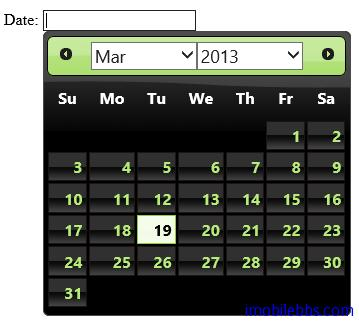
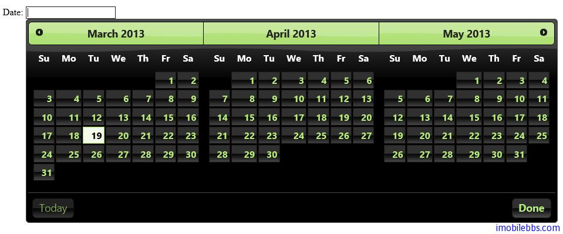

#jQuery UI Datepicker 示例（二）

##显示月份和年份选择下拉框

changeMonth 和 changeYear 选择可以打开和关闭月份和年份下拉选择框。

```
<!doctype html>
<html lang="en">
<head>
    <meta charset="utf-8" />
    <title>jQuery UI Demos</title>
    <link rel="stylesheet" href="themes/trontastic/jquery-ui.css" />
    <script src="scripts/jquery-1.9.1.js"></script>
    <script src="scripts/jquery-ui-1.10.1.custom.js"></script>
    <script>
        $(function () {
            $("#datepicker").datepicker({
                changeMonth: true,
                changeYear: true
            });
        });
    </script>
</head>
<body>
    <p>
        Date:
        <input type="text" id="datepicker" />
    </p>
</body>
</html>
```



##显示多个月份

选项 numberOfMonths 可以用控制同时显示几个月份：

```
$(function () {
	$("#datepicker").datepicker({
		numberOfMonths: 3,
		showButtonPanel: true
	});
});
```



