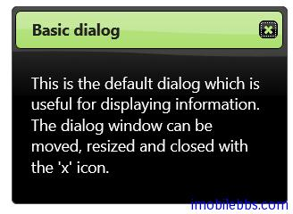
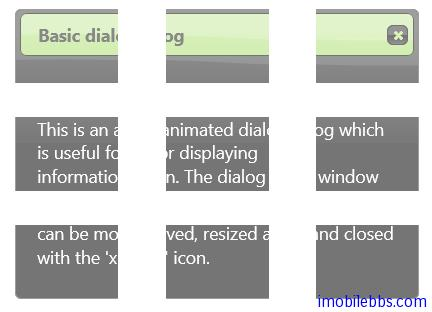

#jQuery UI Dialog 示例（一）

jQuery Dialog 组件用来显示对话框，模式或非模式的。

##基本用法

```
<!doctype html>
<html lang="en">
<head>
    <meta charset="utf-8" />
    <title>jQuery UI Demos</title>
    <link rel="stylesheet" href="themes/trontastic/jquery-ui.css" />
    <script src="scripts/jquery-1.9.1.js"></script>
    <script src="scripts/jquery-ui-1.10.1.custom.js"></script>
    <script>
        $(function () {
            $("#dialog").dialog();
        });
  </script>
</head>
<body>
 
<div id="dialog" title="Basic dialog">
    <p>This is the default dialog which 
        is useful for displaying information.
        The dialog window can be moved, 
        resized and closed with the 'x' icon.</p>
</div>
 
 
</body>
</html>
```



对话框的缺省显示有“X”关闭按钮，可以缩放，移动。

##动画显示效果

可以为对话框显示和关闭添加动画效果，如果不希望对话框一开始就显示（这可能是大部分情况，在点击按钮或是某个事件发生后再显示对话框）可以通过配置 autoOpen=false 来设置。

```
<!doctype html>
<html lang="en">
<head>
    <meta charset="utf-8" />
    <title>jQuery UI Demos</title>
    <link rel="stylesheet" href="themes/trontastic/jquery-ui.css" />
    <script src="scripts/jquery-1.9.1.js"></script>
    <script src="scripts/jquery-ui-1.10.1.custom.js"></script>
    <script>
        $(function () {
            $("#dialog").dialog({
                autoOpen: false,
                show: {
                    effect: "blind",
                    duration: 1000
                },
                hide: {
                    effect: "explode",
                    duration: 1000
                }
            });

            $("#opener").click(function () {
                $("#dialog").dialog("open");
            });
        });
  </script>
</head>
<body>
 
<div id="dialog" title="Basic dialog">
    <p>This is an animated dialog which is useful 
        for displaying information. 
        The dialog window can be moved,
         resized and closed with the 'x' icon.</p>
</div>
 <button id="opener">Open Dialog</button>
 
</body>
</html>
```



show 和 hide 支持的动画效果，后面再专门介绍，这些效果同时使用与其它方面，为 jQuery 支持的通用的动态效果。