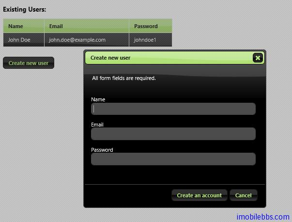

#jQuery UI Dialog 示例（三）

本篇使用 Dialog 构造一个比较实用的对话框，它可以内嵌一个表单用来接受用户输入，每个输入框支持数据校验，部分使用正则表达式来检验。

```
<!doctype html>
<html lang="en">
<head>
    <meta charset="utf-8" />
    <title>jQuery UI Demos</title>
    <link rel="stylesheet" href="themes/trontastic/jquery-ui.css" />
    <script src="scripts/jquery-1.9.1.js"></script>
    <script src="scripts/jquery-ui-1.10.1.custom.js"></script>
    <style>
        body {
            font-size: 62.5%;
        }

        label, input {
            display: block;
        }

            input.text {
                margin-bottom: 12px;
                width: 95%;
                padding: .4em;
            }

        fieldset {
            padding: 0;
            border: 0;
            margin-top: 25px;
        }

        h1 {
            font-size: 1.2em;
            margin: .6em 0;
        }

        div#users-contain {
            width: 350px;
            margin: 20px 0;
        }

            div#users-contain table {
                margin: 1em 0;
                border-collapse: collapse;
                width: 100%;
            }

                div#users-contain table td, div#users-contain table th {
                    border: 1px solid #eee;
                    padding: .6em 10px;
                    text-align: left;
                }

        .ui-dialog .ui-state-error {
            padding: .3em;
        }

        .validateTips {
            border: 1px solid transparent;
            padding: 0.3em;
        }
    </style>
<!-- ReSharper disable ExpressionIsAlwaysConst -->
    <script>
        $(function () {
            var name = $("#name"),
              email = $("#email"),
              password = $("#password"),
              allFields = $([]).add(name).add(email).add(password),
              tips = $(".validateTips");

            function updateTips(t) {
                tips
                  .text(t)
                  .addClass("ui-state-highlight");
                setTimeout(function () {
                    tips.removeClass("ui-state-highlight", 1500);
                }, 500);
            }

            function checkLength(o, n, min, max) {
                if (o.val().length > max || o.val().length < min) {
                    o.addClass("ui-state-error");
                    updateTips("Length of " + n + " must be between " +
                      min + " and " + max + ".");
                    return false;
                } else {
                    return true;
                }
            }

            function checkRegexp(o, regexp, n) {
                if (!(regexp.test(o.val()))) {
                    o.addClass("ui-state-error");
                    updateTips(n);
                    return false;
                } else {
                    return true;
                }
            }

            $("#dialog-form").dialog({
                autoOpen: false,
                height: 300,
                width: 350,
                modal: true,
                buttons: {
                    "Create an account": function () {
                        var bValid = true;
                        allFields.removeClass("ui-state-error");

                        bValid = bValid && checkLength(name, "username", 3, 16);
                        bValid = bValid && checkLength(email, "email", 6, 80);
                        bValid = bValid && checkLength(password, "password", 5, 16);

                        bValid = bValid && checkRegexp(name, /^[a-z]([0-9a-z_])+$/i,
                            "Username may consist of a-z, 0-9, " +
                                "underscores, begin with a letter.");
                        // From jquery.validate.js (by joern), 
                        // contributed by Scott Gonzalez: 
                        // http://projects.scottsplayground.com/email_address_validation/
                        bValid = bValid && checkRegexp(email,
                            /^((([a-z]|\d|[!#\$%&'\*\+\-\/=\?\^_`{\|}~]|[\u00A0-\uD7FF\uF900-\uFDCF\uFDF0-\uFFEF])+(\.([a-z]|\d|[!#\$%&'\*\+\-\/=\?\^_`{\|}~]|[\u00A0-\uD7FF\uF900-\uFDCF\uFDF0-\uFFEF])+)*)|((\x22)((((\x20|\x09)*(\x0d\x0a))?(\x20|\x09)+)?(([\x01-\x08\x0b\x0c\x0e-\x1f\x7f]|\x21|[\x23-\x5b]|[\x5d-\x7e]|[\u00A0-\uD7FF\uF900-\uFDCF\uFDF0-\uFFEF])|(\\([\x01-\x09\x0b\x0c\x0d-\x7f]|[\u00A0-\uD7FF\uF900-\uFDCF\uFDF0-\uFFEF]))))*(((\x20|\x09)*(\x0d\x0a))?(\x20|\x09)+)?(\x22)))@((([a-z]|\d|[\u00A0-\uD7FF\uF900-\uFDCF\uFDF0-\uFFEF])|(([a-z]|\d|[\u00A0-\uD7FF\uF900-\uFDCF\uFDF0-\uFFEF])([a-z]|\d|-|\.|_|~|[\u00A0-\uD7FF\uF900-\uFDCF\uFDF0-\uFFEF])*([a-z]|\d|[\u00A0-\uD7FF\uF900-\uFDCF\uFDF0-\uFFEF])))\.)+(([a-z]|[\u00A0-\uD7FF\uF900-\uFDCF\uFDF0-\uFFEF])|(([a-z]|[\u00A0-\uD7FF\uF900-\uFDCF\uFDF0-\uFFEF])([a-z]|\d|-|\.|_|~|[\u00A0-\uD7FF\uF900-\uFDCF\uFDF0-\uFFEF])*([a-z]|[\u00A0-\uD7FF\uF900-\uFDCF\uFDF0-\uFFEF])))\.?$/i, "eg. ui@jquery.com");
                        bValid = bValid && checkRegexp(password,
                            /^([0-9a-zA-Z])+$/,
                            "Password field only allow : a-z 0-9");

                        if (bValid) {
                            $("#users tbody").append("<tr>" +
                              "<td>" + name.val() + "</td>" +
                              "<td>" + email.val() + "</td>" +
                              "<td>" + password.val() + "</td>" +
                            "</tr>");
                            $(this).dialog("close");
                        }
                    },
                    Cancel: function () {
                        $(this).dialog("close");
                    }
                },
                close: function () {
                    allFields.val("").removeClass("ui-state-error");
                }
            });

            $("#create-user")
              .button()
              .click(function () {
                  $("#dialog-form").dialog("open");
              });
        });
    </script>
<!-- ReSharper restore ExpressionIsAlwaysConst -->
</head>
<body>

    <div id="dialog-form" title="Create new user">
        <p class="validateTips">All form fields are required.</p>

        <form>
            <fieldset>
                <label for="name">Name</label>
                <input type="text" name="name" id="name" 
                   class= "text ui-widget-content ui-corner-all" />
                <label for="email">Email</label>
                <input type="text" name="email" id="email" 
                    value="" class="text ui-widget-content ui-corner-all" />
                <label for="password">Password</label>
                <input type="password" name="password" 
                       id="password" value="" 
                    class="text ui-widget-content ui-corner-all" />
            </fieldset>
        </form>
    </div>


    <div id="users-contain" class="ui-widget">
        <h1>Existing Users:</h1>
        <table id="users" class="ui-widget ui-widget-content">
            <thead>
                <tr class="ui-widget-header ">
                    <th>Name</th>
                    <th>Email</th>
                    <th>Password</th>
                </tr>
            </thead>
            <tbody>
                <tr>
                    <td>John Doe</td>
                    <td>john.doe@example.com</td>
                    <td>johndoe1</td>
                </tr>
            </tbody>
        </table>
    </div>
    <button id="create-user">Create new user</button>


</body>
</html>
```



