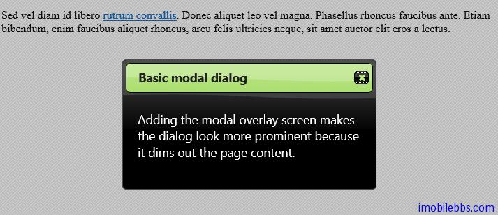
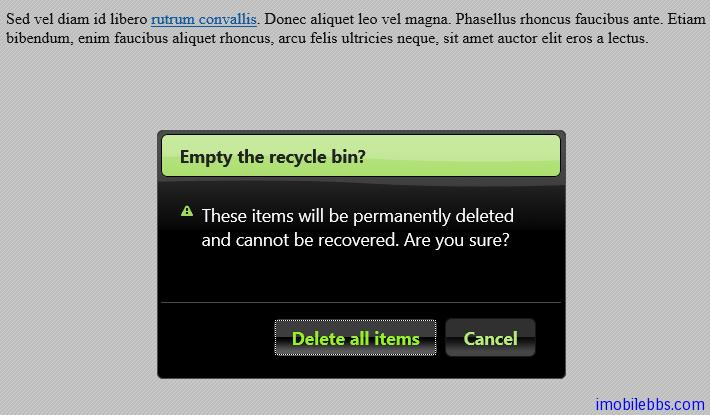

#jQuery UI Dialog 示例（二）

##模式对话框

如想对话框显示为模式的，可以通过配置 modal: true 来设置。

```
<!doctype html>
<html lang="en">
<head>
    <meta charset="utf-8" />
    <title>jQuery UI Demos</title>
    <link rel="stylesheet" href="themes/trontastic/jquery-ui.css" />
    <script src="scripts/jquery-1.9.1.js"></script>
    <script src="scripts/jquery-ui-1.10.1.custom.js"></script>
    <script>
        $(function () {
            $("#dialog-modal").dialog({
                height: 140,
                modal: true
            });
        });
    </script>
</head>
<body>

    <div id="dialog-modal" title="Basic modal dialog">
        <p>
            Adding the modal overlay screen makes the dialog 
        look more prominent because it dims out the page content.
        </p>
    </div>

    <p>
        Sed vel diam id libero <a href="http://example.com">rutrum convallis</a>.
        Donec aliquet leo vel magna. Phasellus rhoncus faucibus ante. 
        Etiam bibendum, enim faucibus aliquet rhoncus, 
        arcu felis ultricies neque, sit amet auctor elit eros a lectus.
    </p>
</body>
</html>
```



##添加确认和取消按钮

可以通过配置主按钮，和从按钮的方法来为对话框添加按钮，此时如果需要把”X”从右上角去掉，可以通过 CSS 来实现，具体可以参考下例：使用 dialogClass: “no-close”

```
<!doctype html>
<html lang="en">
<head>
    <meta charset="utf-8" />
    <title>jQuery UI Demos</title>
    <link rel="stylesheet" href="themes/trontastic/jquery-ui.css" />
    <script src="scripts/jquery-1.9.1.js"></script>
    <script src="scripts/jquery-ui-1.10.1.custom.js"></script>
    <style>
        .no-close .ui-dialog-titlebar-close {
            display: none;
        }
    </style>
    <script>
        $(function () {
            $("#dialog-confirm").dialog({
                dialogClass: "no-close",
                resizable: false,
                width: 400,
                height: 250,
                modal: true,
                buttons: {
                    "Delete all items": function () {
                        $(this).dialog("close");
                    },
                    Cancel: function () {
                        $(this).dialog("close");
                    }
                }
            });
        });
    </script>
</head>
<body>

    <div id="dialog-confirm" title="Empty the recycle bin?">
        <p>

            <span class="ui-icon ui-icon-alert"
                style="float: left; margin: 0 7px 20px 0;"></span>
            These items will be permanently deleted 
        and cannot be recovered. Are you sure?
        </p>
    </div>

    <p>
        Sed vel diam id libero <a href="http://example.com">rutrum convallis</a>.
        Donec aliquet leo vel magna. Phasellus rhoncus faucibus ante.
        Etiam bibendum, enim faucibus aliquet rhoncus,
        arcu felis ultricies neque, 
        sit amet auctor elit eros a lectus.
    </p>


</body>
</html>
```




