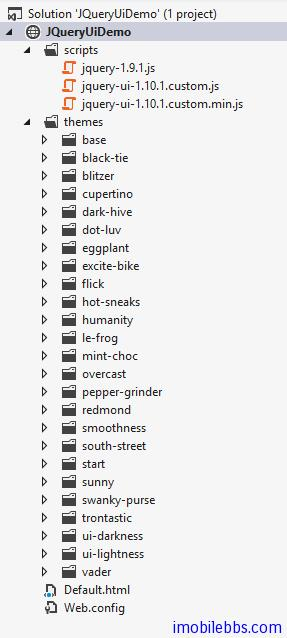
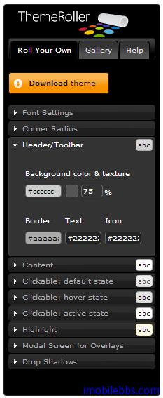

#jQuery UI 示例

上篇介绍了使用 jQuery UI 基本工作过程，后面就逐个介绍 jQuery UI 库内置的 UI 组件，支持的拖放，动画效果等，如果你之前看过 [Yii Framework 教程](http://www.imobilebbs.com/wordpress/%e6%95%99%e7%a8%8b/yii-framework-%e5%bc%80%e5%8f%91%e6%95%99%e7%a8%8b) ，PHP Yii Framework 封装了 jQuery UI 组件，有兴趣的可以看一看。

- [Yii Framework 开发教程(29) Zii 组件-Menu 示例](http://www.imobilebbs.com/wordpress/archives/4063)
- [Yii Framework 开发教程(30) Zii 组件-ListView 示例](http://www.imobilebbs.com/wordpress/archives/4069)
- [Yii Framework 开发教程(31) Zii 组件-DetailView 示例](http://www.imobilebbs.com/wordpress/archives/4074)
- [Yii Framework 开发教程(32) Zii 组件-GridView 示例](http://www.imobilebbs.com/wordpress/archives/4079)
- [Yii Framework 开发教程(33) Zii 组件-Accordion 示例](http://www.imobilebbs.com/wordpress/archives/4085)
- [Yii Framework 开发教程(34) Zii 组件-AutoComplete 示例](http://www.imobilebbs.com/wordpress/archives/4090)
- [Yii Framework 开发教程(35) Zii 组件-Button 示例](http://www.imobilebbs.com/wordpress/archives/4095)
- [Yii Framework 开发教程(36) Zii 组件-DatePicker 示例](http://www.imobilebbs.com/wordpress/archives/4104)
- [Yii Framework 开发教程(37) Zii 组件-Dialog 示例](http://www.imobilebbs.com/wordpress/archives/4110)
- [Yii Framework 开发教程(38) Zii 组件-ProgressBar 示例](http://www.imobilebbs.com/wordpress/archives/4116)
- [Yii Framework 开发教程(39) Zii 组件-Slider 示例](http://www.imobilebbs.com/wordpress/archives/4121)
- [Yii Framework 开发教程(40) Zii 组件-SliderInput 示例](http://www.imobilebbs.com/wordpress/archives/4125)
- [Yii Framework 开发教程(41) Zii 组件-Tabs 示例](http://www.imobilebbs.com/wordpress/archives/4131)
- [Yii Framework 开发教程(42) Zii 组件-Draggable 示例](http://www.imobilebbs.com/wordpress/archives/4136)
- [Yii Framework 开发教程(43) Zii 组件-Droppable 示例](http://www.imobilebbs.com/wordpress/archives/4140)
- [Yii Framework 开发教程(44) Zii 组件-Resizable 示例](http://www.imobilebbs.com/wordpress/archives/4145)
- [Yii Framework 开发教程(45) Zii 组件-Selectable 示例](http://www.imobilebbs.com/wordpress/archives/4150)
- [Yii Framework 开发教程(46) Zii 组件-Sortable 示例](http://www.imobilebbs.com/wordpress/archives/4155)
 
本教程面的示例基本翻译自 jQuery UI 英文网站，部分例子可能有些修改，测试环境依然是 Visual Studio IDE (2012).

jQuery UI 也支持多种显示主题。

