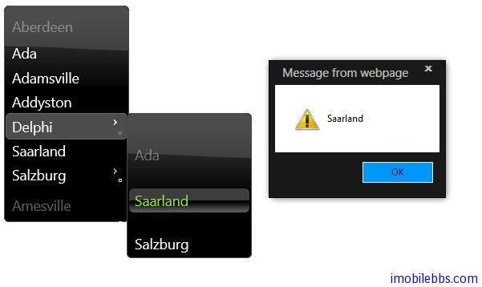
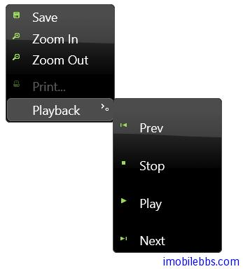

#jQuery UI Menu 示例

jQuery Menu 组件可以应用到任何具有父/子关系的元素，就其变为菜单，但通常使用 u>,li ,如果你希望使用除 ul,li 之外的元素，可以通过 menus 来配置。下例使用缺省的 ui 和 li
菜单支持选择事件 select，因此可以为菜单添加事件处理。

##基本用法

```
<!doctype html>
<html lang="en">
<head>
    <meta charset="utf-8" />
    <title>jQuery UI Demos</title>
    <link rel="stylesheet" href="themes/trontastic/jquery-ui.css" />
    <script src="scripts/jquery-1.9.1.js"></script>
    <script src="scripts/jquery-ui-1.10.1.custom.js"></script>
    <script>
        $(function () {
            $("#menu").menu({
                select: function(event, ui) {
                    alert(ui.item.context.innerText);
                }
            });
        });
    </script>
    <style>
        .ui-menu {
            width: 150px;
        }
    </style>
</head>
<body>

    <ul id="menu">
        <li class="ui-state-disabled"><a href="#">Aberdeen</a></li>
        <li><a href="#">Ada</a></li>
        <li><a href="#">Adamsville</a></li>
        <li><a href="#">Addyston</a></li>
        <li>
            <a href="#">Delphi</a>
            <ul>
                <li class="ui-state-disabled"><a href="#">Ada</a></li>
                <li><a href="#">Saarland</a></li>
                <li><a href="#">Salzburg</a></li>
            </ul>
        </li>
        <li><a href="#">Saarland</a></li>
        <li>
            <a href="#">Salzburg</a>
            <ul>
                <li>
                    <a href="#">Delphi</a>
                    <ul>
                        <li><a href="#">Ada</a></li>
                        <li><a href="#">Saarland</a></li>
                        <li><a href="#">Salzburg</a></li>
                    </ul>
                </li>
                <li>
                    <a href="#">Delphi</a>
                    <ul>
                        <li><a href="#">Ada</a></li>
                        <li><a href="#">Saarland</a></li>
                        <li><a href="#">Salzburg</a></li>
                    </ul>
                </li>
                <li><a href="#">Perch</a></li>
            </ul>
        </li>
        <li class="ui-state-disabled"><a href="#">Amesville</a></li>
    </ul>

</body>
</html>
```



##添加图标

可以为菜单项添加图标，这是通过 定义不同的 CSS 类来添加的。

```
<!doctype html>
<html lang="en">
<head>
    <meta charset="utf-8" />
    <title>jQuery UI Demos</title>
    <link rel="stylesheet" href="themes/trontastic/jquery-ui.css" />
    <script src="scripts/jquery-1.9.1.js"></script>
    <script src="scripts/jquery-ui-1.10.1.custom.js"></script>
    <script>
        $(function () {
            $("#menu").menu();
        });
    </script>
    <style>
        .ui-menu {
            width: 150px;
        }
    </style>
</head>
<body>

    <ul id="menu">
        <li>
            <a href="#">
                <span class="ui-icon ui-icon-disk"></span>Save
            </a>
        </li>
        <li>
            <a href="#">
                <span class="ui-icon ui-icon-zoomin"></span>Zoom In
            </a>
        </li>
        <li>
            <a href="#">
                <span class="ui-icon ui-icon-zoomout"></span>Zoom Out
            </a>
        </li>
        <li class="ui-state-disabled">
            <a href="#">
                <span class="ui-icon ui-icon-print"></span>
                Print...

            </a></li>
        <li>
            <a href="#">Playback</a>
            <ul>
                <li>
                    <a href="#">
                        <span class="ui-icon ui-icon-seek-start"></span>Prev
                    </a></li>
                <li>
                    <a href="#">
                        <span class="ui-icon ui-icon-stop"></span>Stop
                    </a></li>
                <li>
                    <a href="#">
                        <span class="ui-icon ui-icon-play"></span>Play
                    </a>
                </li>
                <li>
                    <a href="#">
                        <span class="ui-icon ui-icon-seek-end"></span>Next
                    </a>
                </li>
            </ul>
        </li>
    </ul>


</body>
</html>
```




