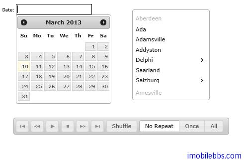
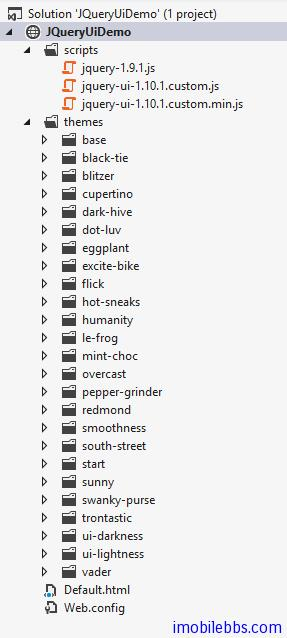

#jQuery UI 概述

前面介紹了 jQuery 的基本用法，jQuery UI 是一套 [JavaScript 函式庫](http://zh.wikipedia.org/wiki/%E5%87%BD%E5%BC%8F%E5%BA%AB)，提供抽象化、可自訂主題的 [GUI 控制項](http://zh.wikipedia.org/wiki/%E6%8E%A7%E4%BB%B6)與動畫效果。基於 [jQuery](http://zh.wikipedia.org/wiki/JQuery) JavaScript 函式庫，可用來建構互動式的 Web 應用。

它的基本功能有：

##互動

- 拖曳（Draggable） – 讓元素可以用滑鼠拖曳。
- 拖放（Droppable） – 讓控制項可以接受其他拖曳進來的元素。
- 調整大小（Resizable） – 讓元素可以調整大小。
- 選取（Selectable） – 提供進階的大量元素選擇功能。
- 排序（Sortable） – 讓列表可以更容易排序。

##控制項
jQuery UI 的所有控制項都能自訂主題樣式。

- 手風琴式選單（Accordion） – 如手風琴般可伸縮的控制項。
- 自動完成（Autocomplete） – 根據使用者的輸入來自動完成文字欄。
- 按鈕（Button） – 增強按鈕外觀，將單選與複選控制項轉變成按鈕型式。
- 日期選擇器（Datepicker） – 進階的日期選擇工具。
- 對話框（Dialog） –在頁面最上層顯示對話框。
- 選單（Menu） – 顯示多階層式的選單。
- 進度條（Progressbar） – 動態與靜態的進度指示條。
- 滑動條（Slider） – 完全可以自訂的滑動條與各種功能。
- 微調選擇器（Spinner） – 上下控制的數字微調輸入欄。
- 頁簽（Tabs） – 頁簽切換控制項，可以內嵌或動態載入內容。
- 工具提示（Tooltip） – 彈出式提示框。

##效果
- 顏色動畫（Color Animation） – 產生顏色轉變的動畫效果。
- 切換 Class、新增 Class、移除 Class、開關 Class – 讓頁面上元素樣式轉變時有動畫效果。
- 效果（Effects） – 各種效果（顯示、下拉、爆炸、淡入等等）。
- 切換（Toggle） – 切換效果開關。
- 隱藏、顯示 – 使用上述的效果。

##工具
- 位置（Position） – 根據另一個元素來設定目標元素的位置（對齊）。

下圖為使用 jQuery UI 一些 UI 組件



後面的例子，我們依然是 visual studio 作為開發 IDE，從 http://jqueryui.com 現在最新版的 jQuery 庫，並支持的主題，創建一個 jQueryUIDemo 項目：



scripts 目錄存放 jquery core, jquery ui 庫文件， themes 目錄存放jQuery 自帶的主題，你可以選擇你喜歡的主題，本教程使用其中的「trontastic」主題。創建一個預設的 Default.html 作為測試頁面，如下定義：

```
<!doctype html>
<html lang="en">
<head>
    <meta charset="utf-8" />
    <title>jQuery UI Demos</title>
    <link rel="stylesheet" href="themes/trontastic/jquery-ui.css" />
    <script src="scripts/jquery-1.9.1.js"></script>
    <script src="scripts/jquery-ui-1.10.1.custom.js"></script>

    <script>
        $(function () {

        });
    </script>
</head>
<body>
</body>
</html>
```

其中<link rel="stylesheet" href="themes/trontastic/jquery-ui.css" /> 指明使用的主題，後面引用 jQuery core, jQuery UI 庫。

