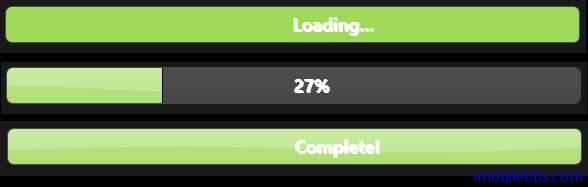

#jQuery UI Progressbar 示例

前面在介绍 [jQuery 入门教程(20): jQuery UI 基本工作过程](http://www.imobilebbs.com/wordpress/archives/4385)时简要介绍过 Progessbar 用法。
在使用进度条时，如果可以预知进度的大小，可以设置 Max 大小，如果对于一些无法预约时间比如下载文件可以使用“中间状态”的状态条。

##基本用法

```
<!doctype html>
<html lang="en">
<head>
    <meta charset="utf-8" />
    <title>jQuery UI Demos</title>
    <link rel="stylesheet" href="themes/trontastic/jquery-ui.css" />
    <script src="scripts/jquery-1.9.1.js"></script>
    <script src="scripts/jquery-ui-1.10.1.custom.js"></script>
    <script>
        $(function () {
            $("#progressbar").progressbar({
                value: 37
            });
        });
    </script>
</head>
<body>

    <div id="progressbar"></div>


</body>
</html>
```

##显示进度

可以在显示进度条的同时显示当前的百分比（实际上可以显示任意文字），这是通过两个嵌套的 div 元素来实现，本例使用一个定时器来模拟进度条的动态效果。

```
<!doctype html>
<html lang="en">
<head>
    <meta charset="utf-8" />
    <title>jQuery UI Demos</title>
    <link rel="stylesheet" href="themes/trontastic/jquery-ui.css" />
    <script src="scripts/jquery-1.9.1.js"></script>
    <script src="scripts/jquery-ui-1.10.1.custom.js"></script>
    <style>
        .progress-label {
            float: left;
            margin-left: 50%;
            margin-top: 5px;
            font-weight: bold;
            text-shadow: 1px 1px 0 #fff;
        }
    </style>
    <script>
        $(function () {
            var progressbar = $("#progressbar"),
              progressLabel = $(".progress-label");

            progressbar.progressbar({
                value: false,
                change: function () {
                    progressLabel.text(progressbar.progressbar("value") + "%");
                },
                complete: function () {
                    progressLabel.text("Complete!");
                }
            });

            function progress() {
                var val = progressbar.progressbar("value") || 0;

                progressbar.progressbar("value", val + 1);

                if (val < 99) {
                    setTimeout(progress, 100);
                }
            }

            setTimeout(progress, 3000);
        });
    </script>
</head>
<body>

    <div id="progressbar">
        <div class="progress-label">Loading...</div>
    </div>


</body>
</html>
```



##“中间过渡”状态条

可以通过设置 value=false 将进度条显示为“过渡”状态的进度条，此外也可以通过配置来修改进度条的颜色

```
<!doctype html>
<html lang="en">
<head>
    <meta charset="utf-8" />
    <title>jQuery UI Demos</title>
    <link rel="stylesheet" href="themes/base/jquery-ui.css" />
    <script src="scripts/jquery-1.9.1.js"></script>
    <script src="scripts/jquery-ui-1.10.1.custom.js"></script>
    <script>
        $(function () {
            $("#progressbar").progressbar({
                value: false
            });
            $("button").on("click", function (event) {
                var target = $(event.target),
                  progressbar = $("#progressbar"),
                  progressbarValue
                      = progressbar.find(".ui-progressbar-value");

                if (target.is("#numButton")) {
                    progressbar.progressbar("option", {
                        value: Math.floor(Math.random() * 100)
                    });
                } else if (target.is("#colorButton")) {
                    progressbarValue.css({
                        "background": '#'
                            + Math.floor(Math.random()
                                * 16777215).toString(16)
                    });
                } else if (target.is("#falseButton")) {
                    progressbar.progressbar("option",
                        "value", false);
                }
            });
        });
    </script>
    <style>
        #progressbar .ui-progressbar-value {
            background-color: #ccc;
        }
    </style>
</head>
<body>

    <div id="progressbar"></div>
    <button id="numButton">Random Value - Determinate</button>
    <button id="falseButton">Indeterminate</button>
    <button id="colorButton">Random Color</button>


</body>
</html>
```


