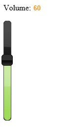
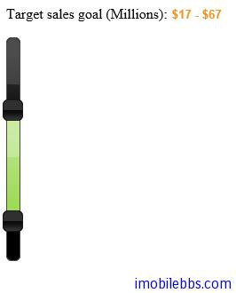

#jQuery UI Slider 示例（二）

前面的 slider 例子 Slider 都是水平顯示的，Slider 也可以顯示成垂直的，這可以通過配置orientation ，將其值設為「vertical」。

##基本用法

```
<!doctype html>
<html lang="en">
<head>
    <meta charset="utf-8" />
    <title>jQuery UI Demos</title>
    <link rel="stylesheet" href="themes/trontastic/jquery-ui.css" />
    <script src="scripts/jquery-1.9.1.js"></script>
    <script src="scripts/jquery-ui-1.10.1.custom.js"></script>
    <script>
        $(function () {
            $("#slider-vertical").slider({
                orientation: "vertical",
                range: "min",
                min: 0,
                max: 100,
                value: 60,
                slide: function (event, ui) {
                    $("#amount").val(ui.value);
                }
            });
            $("#amount").val($("#slider-vertical")
                .slider("value"));
        });
    </script>
</head>
<body>
    <p>
        <label for="amount">Volume:</label>
        <input type="text" id="amount" style="border: 0; 
                 color: #f6931f; font-weight: bold;" />
    </p>

    <div id="slider-vertical" style="height: 200px;"></div>
</body>
</html>
```



##垂直選擇值域

同樣，Slider 垂直顯示時也可以使用兩個滑塊來選擇值域。

```
<!doctype html>
<html lang="en">
<head>
    <meta charset="utf-8" />
    <title>jQuery UI Demos</title>
    <link rel="stylesheet" href="themes/trontastic/jquery-ui.css" />
    <script src="scripts/jquery-1.9.1.js"></script>
    <script src="scripts/jquery-ui-1.10.1.custom.js"></script>
    <script>
        $(function () {
            $("#slider-range").slider({
                orientation: "vertical",
                range: true,
                values: [17, 67],
                slide: function (event, ui) {
                    $("#amount").val("$" + ui.values[0]
                        + " - $" + ui.values[1]);
                }
            });
            $("#amount").val("$" + $("#slider-range")
                .slider("values", 0) +
              " - $" + $("#slider-range").slider("values", 1));
        });
    </script>
</head>
<body>

    <p>
        <label for="amount">Target sales goal (Millions):</label>
        <input type="text" id="amount" style="border: 0; 
                color: #f6931f; font-weight: bold;" />
    </p>

    <div id="slider-range" style="height: 250px;"></div>


</body>
</html>
```




