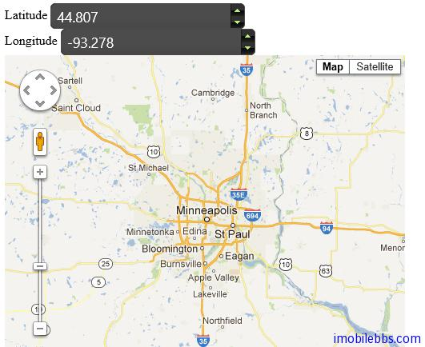

#jQuery UI Spiner 示例

Spinner 主要用来输入各种格式的数字，可以使用鼠标滚轮，键盘方向键来修改输入值，也支持直接键入数字。支持本地化的输入金额和时间。

##基本用法

下面代码显示了 Spinner 的基本用法，设置和取得 Spinner 的当前值。

```
<!doctype html>
<html lang="en">
<head>
    <meta charset="utf-8" />
    <title>jQuery UI Demos</title>
    <link rel="stylesheet" href="themes/trontastic/jquery-ui.css" />
    <script src="scripts/jquery-1.9.1.js"></script>
    <script src="scripts/jquery-ui-1.10.1.custom.js"></script>
    <script>
        $(function () {
            var spinner = $("#spinner").spinner();

            $("#disable").click(function () {
                if (spinner.spinner("option", "disabled")) {
                    spinner.spinner("enable");
                } else {
                    spinner.spinner("disable");
                }
            });
            $("#destroy").click(function () {
                if (spinner.data("ui-spinner")) {
                    spinner.spinner("destroy");
                } else {
                    spinner.spinner();
                }
            });
            $("#getvalue").click(function () {
                alert(spinner.spinner("value"));
            });
            $("#setvalue").click(function () {
                spinner.spinner("value", 5);
            });

            $("button").button();
        });
    </script>
</head>
<body>

    <p>
        <label for="spinner">Select a value:</label>
        <input id="spinner" name="value" />
    </p>

    <p>
        <button id="disable">Toggle disable/enable</button>
        <button id="destroy">Toggle widget</button>
    </p>

    <p>
        <button id="getvalue">Get value</button>
        <button id="setvalue">Set value to 5</button>
    </p>


</body>
</html>
```


##显示地图

本例使用两个 Spinner，以步长为0.001 做为经纬度，然后和 Google 地图配合，通过 Spinner 修改地图的中心。

此外为了适应 Google Map API,需要添加对其引用

代码如下：

```
<!doctype html>
<html lang="en">
<head>
    <meta charset="utf-8" />
    <title>jQuery UI Demos</title>
    <link rel="stylesheet" href="themes/trontastic/jquery-ui.css" />
    <script src="scripts/jquery-1.9.1.js"></script>
    <script src="scripts/jquery-ui-1.10.1.custom.js"></script>
    <script src="http://maps.google.com/maps/api/js?sensor=false"></script>
    <script>
        $(function () {
            function latlong() {
                return new window.google.maps.LatLng($("#lat").val(),
                    $("#lng").val());
            }
            function position() {
                map.setCenter(latlong());
            }
            $("#lat, #lng").spinner({
                step: .001,
                change: position,
                stop: position
            });

            var map = new window.google.maps.Map($("#map")[0], {
                zoom: 8,
                center: latlong(),
                mapTypeId: window.google.maps.MapTypeId.ROADMAP
            });
        });
  </script>
  <style>
  #map {
    width:500px;
    height:500px;
  }
  </style>
</head>
<body>
 
<label for="lat">Latitude</label>
<input id="lat" name="lat" value="44.797" />
<br />
<label for="lng">Longitude</label>
<input id="lng" name="lng" value="-93.278" />
 
<div id="map"></div>
 
 
</body>
</html>
```




