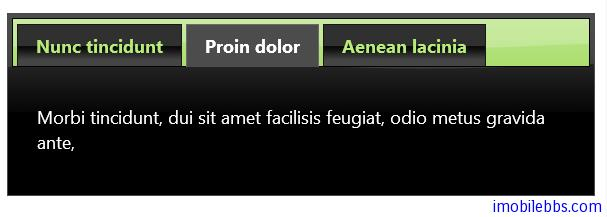

#jQuery UI Tab 示例（一）

Tab 显示多个标签页，每个标签含有一个标签头和一个 Panel（显示标签的内容）。

##基本用法

首先使用 HTML 定义用来作为 Tab，一般使用列表（ul ,li) 来定义标签页的标题，每个标题使用href 链接到每个页面的内容页，比如下例定义了三个标签页：

```
<div id="tabs">
	<ul>
		<li><a href="#tabs-1">Nunc tincidunt</a></li>
		<li><a href="#tabs-2">Proin dolor</a></li>
		<li><a href="#tabs-3">Aenean lacinia</a></li>
	</ul>
	<div id="tabs-1">
		<p>Proin elit arcu, rutrum commodo, vehicula tempus, </p>
	</div>
	<div id="tabs-2">
		<p>Morbi tincidunt, dui sit amet facilisis feugiat, odio metus gravida ante, </p>
	</div>
	<div id="tabs-3">
		<p>Mauris eleifend est et turpis. Duis id erat. </p>
		<p>Duis cursus. Maecenas ligula eros, blandit nec, pharetra at, semper at, </p>
	</div>
</div>
```

然后使用 jQuery 的 tabs()方法把这部分 Html 元素变为标签页

```
<script>
	$(function () {
		$("#tabs").tabs();
	});
</script>
```



