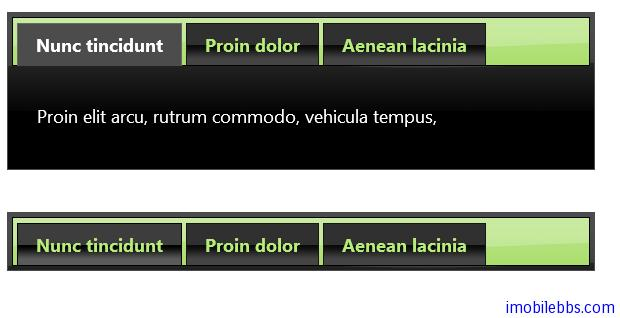
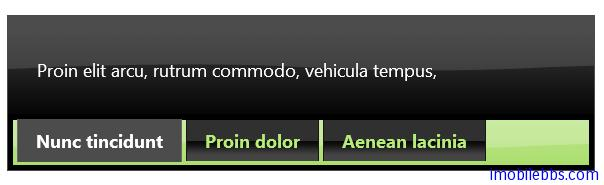
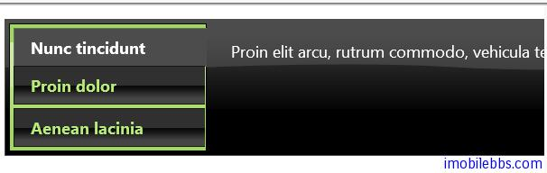

#jQuery UI Tab 示例（二）

##支持收缩和展开

缺省情况下，标签页是展开的，可以通过设置 collapsible 为 true 使得标签页支持收缩和展开。

```
<script>
	$(function () {
		$("#tabs").tabs({
			collapsible: true
		});
	});
</script>
```



##Ajax 支持

jQuery 的标签页也支持通过 Ajax 方法来加载页面，这是通过设置 href 属性来实现，href 指向其它页面，这是 jQuery 通过 Ajax 方法读取指定页面，如果加载时间过长，则页面显示 Loading (加载中），如果无法加载，也可以通过配置 beforeLoad 设置错误信息。

```
<script>
  $(function() {
    $( "#tabs" ).tabs({
      beforeLoad: function( event, ui ) {
        ui.jqXHR.error(function() {
          ui.panel.html(
            "Couldn't load this tab. We'll try to fix this as soon as possible. " +
            "If this wouldn't be a demo." );
        });
      }
    });
  });
  </script>
</head>
<body>
 
<div id="tabs">
  <ul>
    <li><a href="#tabs-1">Preloaded</a></li>
    <li><a href="ajax/content1.html">Tab 1</a></li>
    <li><a href="ajax/content2.html">Tab 2</a></li>
    <li><a href="ajax/content3-slow.php">Tab 3 (slow)</a></li>
    <li><a href="ajax/content4-broken.php">Tab 4 (broken)</a></li>
  </ul>
  <div id="tabs-1">
    <p>Proin elit arcu, rutrum commod</p>
  </div>
</div>
```

##鼠标移动自动激活页面

可以通过设置 event:mouseover 来实现，这样当鼠标移动到某个页面，该页面则自动展开。

```
<script>
  $(function() {
    $( "#tabs" ).tabs({
      event: "mouseover"
    });
  });
</script>
```

##在底部和左边显示标签头

通过 CSS 和一些 JavaScript 可以把标签页的标题显示在底部或是左边

```
<!doctype html>
<html lang="en">
<head>
    <meta charset="utf-8" />
    <title>jQuery UI Demos</title>
    <link rel="stylesheet" href="themes/trontastic/jquery-ui.css" />
    <script src="scripts/jquery-1.9.1.js"></script>
    <script src="scripts/jquery-ui-1.10.1.custom.js"></script>
    <script>
        $(function () {
            $("#tabs").tabs();

            // fix the classes
            $(".tabs-bottom .ui-tabs-nav, .tabs-bottom .ui-tabs-nav > *")
              .removeClass("ui-corner-all ui-corner-top")
              .addClass("ui-corner-bottom");

            // move the nav to the bottom
            $(".tabs-bottom .ui-tabs-nav").appendTo(".tabs-bottom");
        });
    </script>
    <style>
        /* force a height so the tabs don't jump as content height changes */
        #tabs .tabs-spacer {
            float: left;
            height: 200px;
        }

        .tabs-bottom .ui-tabs-nav {
            clear: left;
            padding: 0 .2em .2em .2em;
        }

            .tabs-bottom .ui-tabs-nav li {
                top: auto;
                bottom: 0;
                margin: 0 .2em 1px 0;
                border-bottom: auto;
                border-top: 0;
            }

                .tabs-bottom .ui-tabs-nav li.ui-tabs-active {
                    margin-top: -1px;
                    padding-top: 1px;
                }
    </style>
</head>
<body>

    <div id="tabs" class="tabs-bottom">
        <ul>
            <li><a href="#tabs-1">Nunc tincidunt</a></li>
            <li><a href="#tabs-2">Proin dolor</a></li>
            <li><a href="#tabs-3">Aenean lacinia</a></li>
        </ul>
        <div id="tabs-1">
            <p>Proin elit arcu, rutrum commodo, vehicula tempus, </p>
        </div>
        <div id="tabs-2">
            <p>Morbi tincidunt, dui sit amet facilisis feugiat, odio metus gravida ante, </p>
        </div>
        <div id="tabs-3">
            <p>Mauris eleifend est et turpis. Duis id erat. </p>
            <p>Duis cursus. Maecenas ligula eros, blandit nec, pharetra at, semper at, </p>
        </div>
    </div>


</body>
</html>
```



```
<!doctype html>
<html lang="en">
<head>
    <meta charset="utf-8" />
    <title>jQuery UI Demos</title>
    <link rel="stylesheet" href="themes/trontastic/jquery-ui.css" />
    <script src="scripts/jquery-1.9.1.js"></script>
    <script src="scripts/jquery-ui-1.10.1.custom.js"></script>
    <script>
        $(function () {
            $("#tabs").tabs().addClass("ui-tabs-vertical ui-helper-clearfix");
            $("#tabs li").removeClass("ui-corner-top").addClass("ui-corner-left");
        });
    </script>
    <style>
        .ui-tabs-vertical {
            width: 55em;
        }

            .ui-tabs-vertical .ui-tabs-nav {
                padding: .2em .1em .2em .2em;
                float: left;
                width: 12em;
            }

                .ui-tabs-vertical .ui-tabs-nav li {
                    clear: left;
                    width: 100%;
                    border-bottom-width: 1px !important;
                    border-right-width: 0 !important;
                    margin: 0 -1px .2em 0;
                }

                    .ui-tabs-vertical .ui-tabs-nav li a {
                        display: block;
                    }

                    .ui-tabs-vertical .ui-tabs-nav li.ui-tabs-active {
                        padding-bottom: 0;
                        padding-right: .1em;
                        border-right-width: 1px;
                        border-right-width: 1px;
                    }

            .ui-tabs-vertical .ui-tabs-panel {
                padding: 1em;
                float: right;
                width: 40em;
            }
    </style>
</head>
<body>

    <div id="tabs">
        <ul>
            <li><a href="#tabs-1">Nunc tincidunt</a></li>
            <li><a href="#tabs-2">Proin dolor</a></li>
            <li><a href="#tabs-3">Aenean lacinia</a></li>
        </ul>
        <div id="tabs-1">
            <p>Proin elit arcu, rutrum commodo, vehicula tempus, </p>
        </div>
        <div id="tabs-2">
            <p>Morbi tincidunt, dui sit amet facilisis feugiat, odio metus gravida ante, </p>
        </div>
        <div id="tabs-3">
            <p>Mauris eleifend est et turpis. Duis id erat. </p>
            <p>Duis cursus. Maecenas ligula eros, blandit nec, pharetra at, semper at, </p>
        </div>
    </div>


</body>
</html>
```




