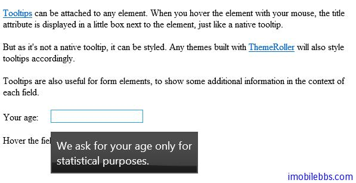

#jQuery UI Tooltip 示例

JQuery tooltip 的基本用法，可以把所有元素的的 title 属性做为 Toolbar 显示，比如：

```
<!doctype html>
<html lang="en">
<head>
    <meta charset="utf-8" />
    <title>jQuery UI Demos</title>
    <link rel="stylesheet" href="themes/trontastic/jquery-ui.css" />
    <script src="scripts/jquery-1.9.1.js"></script>
    <script src="scripts/jquery-ui-1.10.1.custom.js"></script>
    <script>
        $(function () {
            $(document).tooltip();
        });
  </script>
  <style>
  label {
    display: inline-block;
    width: 5em;
  }
  </style>
</head>
<body>
 
<p><a href="#" title="That's what this widget is">Tooltips</a> can be attached to any element. When you hover
the element with your mouse, the title attribute is displayed in a little box next to the element, just like a native tooltip.</p>
<p>But as it's not a native tooltip, it can be styled. Any themes built with
<a href="http://themeroller.com" title="ThemeRoller: jQuery UI's theme builder application">ThemeRoller</a>
will also style tooltips accordingly.</p>
<p>Tooltips are also useful for form elements, to show some additional information in the context of each field.</p>
<p><label for="age">Your age:</label><input id="age" title="We ask for your age only for statistical purposes." /></p>
<p>Hover the field to see the tooltip.</p>
 
 
</body>
</html>
```



此外，可以通过 CSS 修改缺省 Tooltip 的显示风格，或是自定义 Tooltip 显示内容（比如地图，图像等等），这里就不一一介绍了。