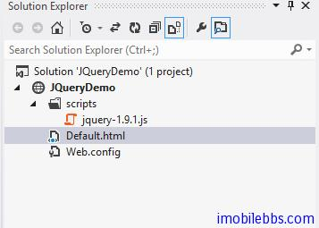

#概述

jQuery 是一套跨[浏览器](http://zh.wikipedia.org/wiki/%E7%80%8F%E8%A6%BD%E5%99%A8)的 [JavaScript 函式库](http://zh.wikipedia.org/wiki/JavaScript)，简化 [HTML](http://zh.wikipedia.org/wiki/HTML) 与JavaScript 之间的操作，下面为摘自 Wikepedia 上的 jQuery 说明：

jQuery 是 [开源软件](http://zh.wikipedia.org/wiki/%E5%BC%80%E6%BA%90%E8%BD%AF%E4%BB%B6)，使用[MIT 许可证](http://zh.wikipedia.org/wiki/MIT%E8%AE%B8%E5%8F%AF%E8%AF%81)授权。[[4]](http://zh.wikipedia.org/wiki/JQuery#cite_note-4) jQuery 的语法设计使得许多操作变得容易，如操作文档对象（document）、选择 [DOM](http://zh.wikipedia.org/wiki/%E6%96%87%E6%A1%A3%E5%AF%B9%E8%B1%A1%E6%A8%A1%E5%9E%8B) 元素、创建[动画](http://zh.wikipedia.org/wiki/%E5%8A%A8%E7%94%BB)效果、处理[事件](http://zh.wikipedia.org/w/index.php?title=%E4%BA%8B%E4%BB%B6_(%E8%AE%A1%E7%AE%97%E6%9C%BA)&action=edit&redlink=1)、以及开发 [Ajax](http://zh.wikipedia.org/wiki/AJAX) 程序。jQuery 也提供了给开发人员在其上创建插件的能力。这使开发人员可以对底层交互与动画、高级效果和高级主题化的组件进行抽象化。模块化的方式使 jQuery 函数库能够创建功能强大的[动态网页](http://zh.wikipedia.org/wiki/%E5%8B%95%E6%85%8BHTML)以及[网络应用程序](http://zh.wikipedia.org/wiki/%E7%BD%91%E7%BB%9C%E5%BA%94%E7%94%A8%E7%A8%8B%E5%BA%8F)。

- jQuery 有下列特色:

- 跨浏览器的 [DOM](http://zh.wikipedia.org/wiki/DOM) 元素选择
- [DOM](http://zh.wikipedia.org/wiki/DOM) 巡访与更改：支援 [CSS](http://zh.wikipedia.org/wiki/CSS) 1-3与 基本的 [XPath](http://zh.wikipedia.org/wiki/XPath)，jQuery 1.2版以后默认取消 [XPath](http://zh.wikipedia.org/wiki/XPath) 支持，改为插件支持
- 事件（Events）
- [CSS](http://zh.wikipedia.org/wiki/CSS) 操纵
- 特效和动画（移动显示位置、淡入、淡出）
- [Ajax](http://zh.wikipedia.org/wiki/Ajax)
- 延伸性（Extensibility）
- 工具：例如浏览器版本和each函数。
- [JavaScript](http://zh.wikipedia.org/wiki/JavaScript) 插件
- 轻量级

有很多应用程序开发框架中已经集成了 jQuery，如前面介绍的 [PHP Yii Framework](http://www.imobilebbs.com/wordpress/%e6%95%99%e7%a8%8b/yii-framework-%e5%bc%80%e5%8f%91%e6%95%99%e7%a8%8b) 和 [Java EE Vaadin Web 应用开发框架](http://www.imobilebbs.com/wordpress/%e6%95%99%e7%a8%8b/vaadin-web%e5%ba%94%e7%94%a8%e5%bc%80%e5%8f%91%e6%95%99%e7%a8%8b) ，这些框架可以不使用 JavaScript 而是使用 PHP 或是 Java 来使用 jQuery 的 UI 功能。但了解 jQuery JavaScripts 编程对于更好编写 Web 页面还是有很大的帮助的，[微软](http://zh.wikipedia.org/wiki/%E5%BE%AE%E8%BD%AF)和[诺基亚](http://zh.wikipedia.org/wiki/%E8%AF%BA%E5%9F%BA%E4%BA%9A)已宣布在他们的平台上绑定 jQuery。[[5]](http://zh.wikipedia.org/wiki/JQuery#cite_note-2008-09-28-5) 微软最初在 [Visual Studio](http://zh.wikipedia.org/wiki/Visual_Studio) 中集成了 jQuery[[6]](http://zh.wikipedia.org/wiki/JQuery#cite_note-6) 以便在微软自己的 [ASP.NET AJAX](http://zh.wikipedia.org/wiki/ASP.NET_AJAX) 框架和 [ASP.NET MVC Framework](http://zh.wikipedia.org/wiki/ASP.NET_MVC_Framework) 中使用。因此如果你从事 ASP.Net 或是 Sharepoint Web Part 或是 Application Page 开发了解 jQuery 尤为重要，本教程帮助初学者了解 jQuery 的基本开发，从而为进一步学习其它 Web 编程打好基础。

本教程使用 Visual Studio 为开发工具，你也可以使用你自己喜欢的开发 IDE，Visual Studio 支持 Javascript 的调试，jQuery 使用目前的最新版本 jquery-1.9.1.js.下载到本地。

使用 Visual Studio 创建一个 Website，将下载下来的jquery-1.9.1.js 放在 scripts



添加的 Default.html 具有如下代码框架作为后续示例的基础：

```
<!doctype html>

<meta charset="utf-8" />
JQuery Demo

<script type="text/javascript" src="scripts/jquery-1.9.1.js"></script><script type="text/javascript">// <![CDATA[
        // Your code goes here

// ]]></script>

```

