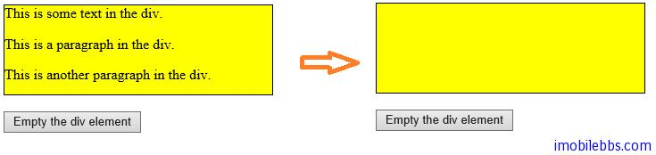

#删除HTML元素

jQuery 使用下面两个方法来删除或是清空某个 HTML 元素。

- remove() – 删除指定的元素（包括其子元素）
- empty() – 清空指定元素的子元素

例如：

```
<!DOCTYPE html>
<html>
<head>
    <meta charset="utf-8">
    <title>JQuery Demo</title>
    <script src="scripts/jquery-1.9.1.js"></script>
    <script>
        $(document).ready(function () {
            $("button").click(function () {
                $("#div1").remove();
            });
        });
    </script>
</head>
<body>

    <div id="div1" style="height: 100px; width: 300px;
        border: 1px solid black; background-color: yellow;">
        This is some text in the div.
        <p>This is a paragraph in the div.</p>
        <p>This is another paragraph in the div.</p>

    </div>
    <br>
    <button>Remove div element</button>

</body>
</html>
```


empty()示例：

```
<!DOCTYPE html>
<html>
<head>
    <meta charset="utf-8">
    <title>JQuery Demo</title>
    <script src="scripts/jquery-1.9.1.js"></script>
    <script>
        $(document).ready(function () {
            $("button").click(function () {
                $("#div1").empty();
            });
        });
    </script>
</head>
<body>

    <div id="div1" style="height: 100px; width: 300px;
        border: 1px solid black; background-color: yellow;">
        This is some text in the div.
        <p>This is a paragraph in the div.</p>
        <p>This is another paragraph in the div.</p>

    </div>
    <br>
    <button>Empty the div element</button>

</body>
</html>
```



jQuery 的 remove()方法也支持一个参数，可以用于过滤一些需要删除的 HTML 元素。这个参数可以为任何有效的 jQuery selector.
比如下面代码只删除 class=”italic”的<p>元素：

```
$("p").remove(".italic");
```
