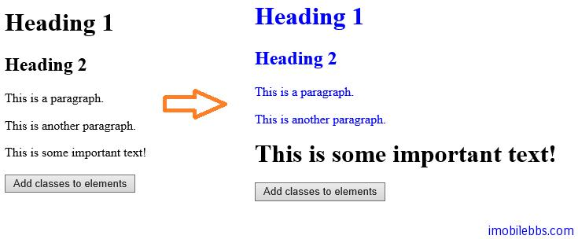

#设置或取得元素的 CSS class
 
jQuery 支持方法用来操作 HTML 元素的 CSS 属性

下面的方法为 jQuery 提供的 CSS 操作方法：

- addClass() – 为指定的元素添加一个或多个 CSS 类。
- removeClass() – 为指定的元素删除一个或多个 CSS 类。
- toggleClass() – 为指定的元素在添加/删除 CSS 类之间切换。
- css() -设置或是取得 CSS 类型属性。


下面的 StyleSheet 为后面例子使用的 CSS 风格：

```
.important
 {
 font-weight:bold;
 font-size:xx-large;
 }

 .blue
 {
 color:blue;
 }
```

jQuery addClass 示例

下面的例子为给定的元素添加 CSS 风格类

```
<!DOCTYPE html>
<html>
<head>
    <meta charset="utf-8">
    <title>JQuery Demo</title>
    <script src="scripts/jquery-1.9.1.js"></script>

    <script>
        $(document).ready(function () {
            $("button").click(function () {
                $("h1,h2,p").addClass("blue");
                $("div").addClass("important");
            });
        });
    </script>
    <style type="text/css">
        .important
        {
            font-weight: bold;
            font-size: xx-large;
        }

        .blue
        {
            color: blue;
        }
    </style>
</head>
<body>

    <h1>Heading 1</h1>
    <h2>Heading 2</h2>
    <p>This is a paragraph.</p>
    <p>This is another paragraph.</p>
    <div>This is some important text!</div>
    <br>
    <button>Add classes to elements</button>

</body>
</html>
```



你也可以在 addClass 添加多个类的名称，如：

```
$("button").click(function(){
   $("#div1").addClass("important blue");
 }); 
```

jQuery removeClass 示例

```
$("button").click(function(){
   $("h1,h2,p").removeClass("blue");
 }); 
```

jQuery toggle()示例，下面的例子使用 toggle 为 HTML 元素在添加/删除 CSS 类 blue 之间切换

```
$("button").click(function(){
   $("h1,h2,p").toggleClass("blue");
 }); 
```

下一篇介绍 css()的用法。