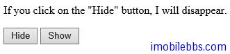

#显示/隐藏内容

jQuery 的 hide() 和 show() 可以用来显示和隐藏内容。比如下面的例子：

```
<!doctype html>
<html>
<head>
    <meta charset="utf-8">
    <title>JQuery Demo</title>
    <script src="scripts/jquery-1.9.1.js"></script>
    <script>
        $(document).ready(function () {
            $("#hide").click(function () {
                $("p").hide();
            });
            $("#show").click(function () {
                $("p").show();
            });
        });
    </script>
</head>
<body>
    <p>If you click on the "Hide" button, I will disappear.</p>
    <button id="hide">Hide</button>
    <button id="show">Show</button>
</body>
</html>
```



基本语法

$(selector).hide(speed,callback);

$(selector).show(speed,callback);

可选的参数 speed 给出显示或隐藏内容的速度，可以使用 “slow”,”fast” 或者数字代表微秒。
第二个可选参数为回调函数，在显示或隐藏结束时调用。下面代码在1秒钟内隐藏内容：

```
$("button").click(function(){
  $("p").hide(1000);
});
```

jQuery toggle()方法

使用 toggle()方法，可以实现交替显示和隐藏内容，如：

```
$("button").click(function(){
  $("p").toggle();
});
```

其基本语法如下：

$(selector).toggle(speed,callback);

可选的参数 speed 给出显示或隐藏内容的速度，可以使用“slow”,”fast”或者数字代表微秒。
第二个可选参数为回调函数，在显示或隐藏结束时调用


